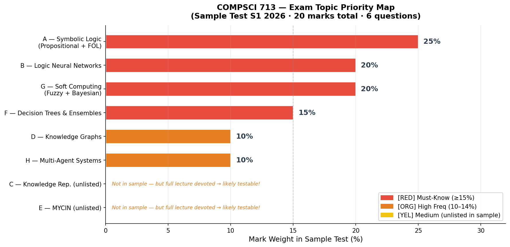

# Exam Topic Frequency Map（考点频率分布）

> Based on: **COMPSCI 713 Sample Test S1 2026** (the only available past paper).
> Frequency measured by **mark weight** since we have one sample.

---

## Visual Overview



## Topic Weight Distribution

| Knowledge Module | Marks | Weight | Priority | Rationale |
|-----------------|-------|--------|----------|-----------|
| **A — Symbolic Logic** (Propositional + FOL) | 5 | 25% | 🔴 必考 | Highest weight; foundational |
| **B — Logic Neural Networks** (LNN) | 4 | 20% | 🔴 必考 | Course signature topic |
| **G — Soft Computing** (Fuzzy, Bayesian, Vagueness vs Uncertainty) | 4 | 20% | 🔴 必考 | Equal second highest weight |
| **F — Decision Trees & Ensembles** (Random Forest, Bagging, Boosting) | 3 | 15% | 🔴 必考 | Tests mechanism + reasoning |
| **D — Knowledge Graphs** (Embeddings, TransE, Inference) | 2 | 10% | 🟠 高频 | Focused question on embeddings |
| **H — Multi-Agent Systems** (Robot Soccer) | 2 | 10% | 🟠 高频 | Recall-based |
| **C — Knowledge Representation** (Expert Systems, Ontologies) | 0 | 0% | 🟡 中频 | Not tested but foundational for D; major lecture topic |
| **E — MYCIN** (Confidence Factors, Backward Chaining) | 0 | 0% | 🟡 中频 | Full lecture devoted; very likely in actual test |

---

## Visual Weight Map

```
Symbolic Logic (A)     ████████████████████████████████████  25%  🔴
LNN (B)                ████████████████████████████          20%  🔴
Soft Computing (G)     ████████████████████████████          20%  🔴
Decision Trees (F)     █████████████████████                 15%  🔴
Knowledge Graphs (D)   ██████████████                        10%  🟠
Multi-Agent (H)        ██████████████                        10%  🟠
Knowledge Rep (C)      ░░░░░░░░ (not in sample)               0%  🟡
MYCIN (E)              ░░░░░░░░ (not in sample)               0%  🟡
```

---

## Priority Levels Explained

### 🔴 必考 (Must-Know) — 80% of sample test marks

You **must** be able to:
- Solve propositional logic truth tables and write FOL expressions
- Compute LNN soft conjunction and explain how it differs from Boolean logic
- Distinguish vagueness from uncertainty with concrete examples
- Explain random forest feature bagging and why it reduces variance

### 🟠 高频 (High Frequency) — 20% of sample test marks

- Explain KG embeddings, TransE ($h + r \approx t$), and link prediction
- Name multi-agent collective strategies

### 🟡 中频 (Medium) — Not in sample but VERY likely in actual test

> **Critical Warning**: The sample is a **sample**, not a predictor. Topics with full lectures (MYCIN, KR/Ontologies) that weren't sampled have HIGH probability of appearing in the actual test.

- MYCIN confidence factor calculations, backward chaining, explanation facility
- Expert Systems vs Ontologies vs KG comparison
- Entropy and Information Gain calculation
- TransE distance calculation with actual vectors

---

## Question Type Distribution

| Type | Count | Marks | What to Practice |
|------|-------|-------|-----------------|
| **Compute / Show Work** | 2 | 5 | Truth tables, LNN operators, entropy |
| **Explain Concept** | 2 | 4 | 2-3 sentence clear explanations |
| **Classify / Judge** | 1 | 4 | Apply distinctions to new scenarios |
| **Recall + Apply** | 1 | 3 | Mechanisms with specific numbers |
| **Recall** | 1 | 2 | Lecture-specific examples |
| **Formalise** | 1 | 2 | English to FOL translation |

---

## Study Time Allocation（学习时间建议）

| Module | Time | Reason |
|--------|------|--------|
| A — Symbolic Logic | 20% | Highest marks; needs practice |
| B — LNN | 15% | Conceptual + computation |
| G — Soft Computing | 15% | Core distinction + fuzzy/Bayesian math |
| F — Decision Trees | 15% | Multiple ensemble methods |
| E — MYCIN | 10% | Not sampled but testable; CF calculation |
| D — Knowledge Graphs | 10% | TransE calculation |
| C — Knowledge Rep | 10% | Background for KG; comparison questions |
| H — Multi-Agent | 5% | Review lecture notes |

---

## Cheat Sheet Recommendations（手写笔记建议）

**Side 1 — Formulas:**
- Truth table for $\rightarrow$, $\wedge$, $\vee$, $\neg$
- FOL quantifier rules: $\neg \forall x \, P(x) \equiv \exists x \, \neg P(x)$
- LNN t-norms: Product ($ab$), Lukasiewicz ($\max(0, a+b-1)$), Godel ($\min(a,b)$)
- TransE: $h + r \approx t$, L1 distance = $\sum |h_i + r_i - t_i|$
- Entropy: $H(X) = -\sum p(x) \log_2 p(x)$
- Information Gain: $IG(Y|X) = H(Y) - H(Y|X)$
- AdaBoost: $\alpha_t = \frac{1}{2}\ln\frac{1-\epsilon_t}{\epsilon_t}$
- MYCIN CF: $CF = CF_{\text{premise}} \times CF_{\text{rule}}$
- Bayes: $P(H|e) = \frac{P(e|H)P(H)}{P(e)}$
- Naive Bayes: $\hat{H} = \arg\max_H P(H) \prod_i P(e_i|H)$
- Fuzzy: AND = min, OR = max, NOT = $1-a$, Implication = $\max(1-A, B)$

**Side 2 — Key Distinctions:**
- Vagueness ("to what degree?") vs Uncertainty ("how likely?")
- Bagging (variance reduction, parallel) vs Boosting (bias reduction, sequential)
- Forward chaining (data-driven) vs Backward chaining (goal-driven)
- Expert Systems (IF-THEN rules) vs Ontologies (formal concepts) vs KG (entity-relation graph)
- Boolean logic (crisp {0,1}) vs Fuzzy logic ([0,1]) vs LNN (differentiable, learnable weights)
- TransE limitation (1-to-N) → TransH (hyperplane projection)
- Random Forest: bootstrap + feature bagging ($\sqrt{p}$ features)
