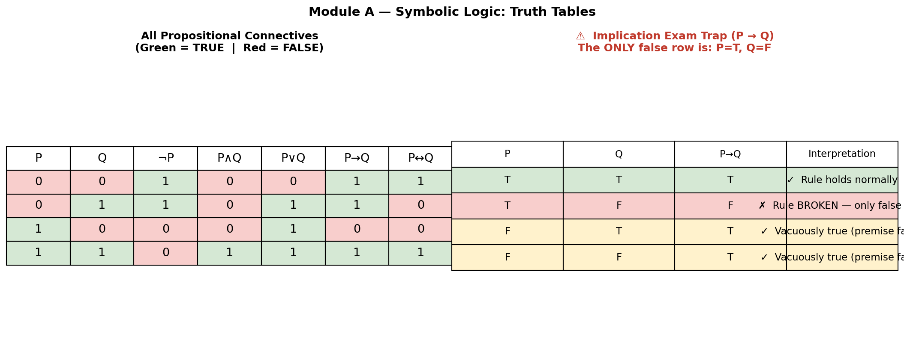
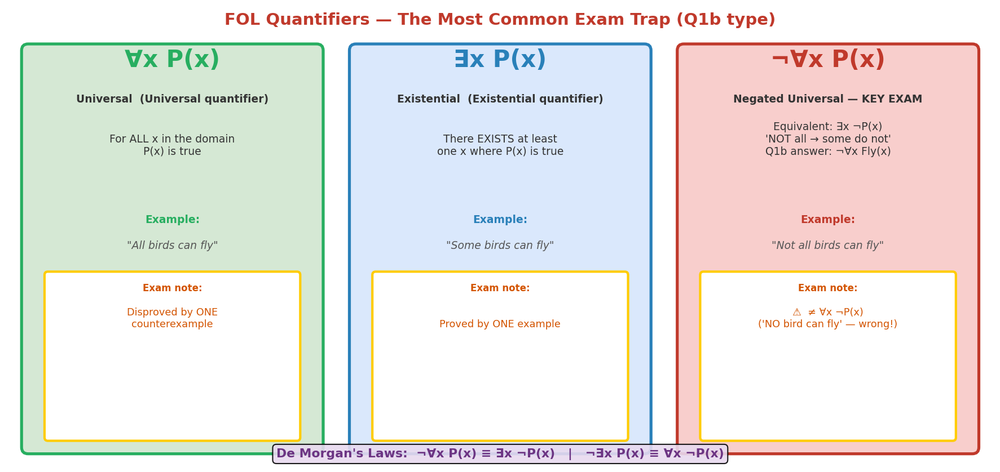

# Symbolic Logic — Propositional & First-Order Logic

## 🎯 Exam Importance
🔴 **必考** | Sample Test Q1: **5 marks = 25%** — the single highest-weighted question

---

## 📖 Core Concepts

| English Term | 中文 | One-line Definition |
|-------------|------|-------------------|
| Propositional Logic（命题逻辑） | 命题逻辑 | Deals with statements that are TRUE or FALSE, combined with logical connectives |
| First-Order Logic / FOL（一阶逻辑） | 一阶逻辑 | Extends propositional logic with variables, quantifiers ($\forall$, $\exists$), and predicates |
| Connective（逻辑联结词） | 联结词 | Operators: $\wedge$ (AND), $\vee$ (OR), $\neg$ (NOT), $\rightarrow$ (IMPLIES), $\leftrightarrow$ (IFF) |
| Modus Ponens（肯定前件） | 肯定前件 | From $P$ and $P \rightarrow Q$, conclude $Q$ |
| Modus Tollens（否定后件） | 否定后件 | From $\neg Q$ and $P \rightarrow Q$, conclude $\neg P$ |
| Resolution（归结） | 归结 | From $P \vee Q$ and $\neg P \vee R$, conclude $Q \vee R$ |
| CNF（合取范式） | 合取范式 | A formula written as AND of ORs: $(A \vee B) \wedge (C \vee \neg D)$ |

---

## 🧠 Feynman Draft — Learning From Scratch

Imagine you're a judge in a court case. The lawyer presents **facts** and **rules**, and you must decide what **conclusions** follow — without guessing, without emotion, purely by the rules of logic.

**Propositional logic** is like the simplest version of this: each "statement" is either TRUE or FALSE (guilty or not guilty), and you combine them with words like "and", "or", "not", "if...then".

For example:
- Let $R$ = "It is raining" (TRUE or FALSE)
- Let $U$ = "I carry an umbrella" (TRUE or FALSE)
- Rule: $R \rightarrow U$ means "If it rains, then I carry an umbrella"

Now, suppose you observe: **I am NOT carrying an umbrella** ($\neg U$). What can you conclude?

Think about it... If the rule says "rain implies umbrella", and there's no umbrella, then it CANNOT be raining. This reasoning pattern is called **Modus Tollens（否定后件）**:

$$P \rightarrow Q, \quad \neg Q \quad \Rightarrow \quad \neg P$$

> This is EXACTLY what Sample Test Q1(a) asks! They give you $(I \wedge F) \rightarrow E$ and $\neg E$, and ask you to deduce what's true about $I$ and $F$.

**First-order logic** goes further. Instead of just "this statement is true/false", you can talk about **things in a world**:
- $\text{Fly}(x)$ = "thing $x$ can fly"
- $\forall x \, \text{Fly}(x)$ = "everything can fly"
- $\exists x \, \neg \text{Fly}(x)$ = "there exists something that cannot fly"

The biologist's claim "Not all birds can fly" becomes: $\neg \forall x \, \text{Fly}(x)$.

> ⚠️ **Common Misconception**: Students write $\forall x \, \neg \text{Fly}(x)$ which means "NOTHING can fly" — way too strong! The negation must be OUTSIDE the quantifier: $\neg \forall x$.

> 💡 **Core Intuition**: Propositional logic is about combining true/false statements; FOL adds the ability to talk about "all" and "some" things in a domain.

---

## 📐 Formal Definitions

### Propositional Logic — Connectives Truth Table

This is the foundation. **Memorize this table** — you will need it for Q1-style questions.

| $P$ | $Q$ | $\neg P$ | $P \wedge Q$ | $P \vee Q$ | $P \rightarrow Q$ | $P \leftrightarrow Q$ |
|-----|-----|---------|-------------|-----------|------------------|---------------------|
| 0 | 0 | 1 | 0 | 0 | **1** | 1 |
| 0 | 1 | 1 | 0 | 1 | **1** | 0 |
| 1 | 0 | 0 | 0 | 1 | **0** | 0 |
| 1 | 1 | 0 | 1 | 1 | **1** | 1 |

> **The tricky row**: $P \rightarrow Q$ is TRUE when $P$ is FALSE (rows 1-2). "If pigs fly, then I'm the queen" is technically TRUE because the premise is false. This is called **vacuous truth（空真）**.

### Key Equivalence

$$P \rightarrow Q \equiv \neg P \vee Q$$

This means "if P then Q" is the same as "either not-P, or Q". Very useful for converting implications.

### First-Order Logic — Quantifiers

| Symbol | Name | Meaning | Example |
|--------|------|---------|---------|
| $\forall$ | Universal（全称量词） | "For all" | $\forall x \, \text{Human}(x) \rightarrow \text{Mortal}(x)$ |
| $\exists$ | Existential（存在量词） | "There exists" | $\exists x \, \text{Cat}(x) \wedge \text{Black}(x)$ |

### Negation of Quantifiers (De Morgan's for quantifiers)

$$\neg \forall x \, P(x) \equiv \exists x \, \neg P(x)$$
$$\neg \exists x \, P(x) \equiv \forall x \, \neg P(x)$$

> "Not all birds fly" = "There exists a bird that doesn't fly"
> "There is no perfect student" = "All students are imperfect"

---

## 🔄 How It Works — Key Inference Rules

### Rule 1: Modus Ponens（肯定前件）

$$\frac{P, \quad P \rightarrow Q}{Q}$$

"If it rains, the ground is wet. It is raining. Therefore, the ground is wet."

### Rule 2: Modus Tollens（否定后件）⭐ Most likely to be tested

$$\frac{P \rightarrow Q, \quad \neg Q}{\neg P}$$

"If it rains, the ground is wet. The ground is NOT wet. Therefore, it is NOT raining."

### Rule 3: Resolution（归结）

$$\frac{P \vee Q, \quad \neg P \vee R}{Q \vee R}$$

Used in automated theorem proving. Requires converting to CNF first.

### Worked Example: Sample Test Q1(a) — Step by Step

**Given:**
- Rule: $(I \wedge F) \rightarrow E$
- Observation: $\neg E$

**Step 1:** Recognize the pattern — this is Modus Tollens with $P = (I \wedge F)$ and $Q = E$.

**Step 2:** Apply Modus Tollens: from $(I \wedge F) \rightarrow E$ and $\neg E$, conclude $\neg (I \wedge F)$.

**Step 3:** Apply De Morgan's Law: $\neg (I \wedge F) \equiv \neg I \vee \neg F$.

**Step 4:** Interpret: "Either I is false (no valid ID) OR F is false (fingerprint doesn't match), or both."

**Truth Table verification (as required by the question):**

For $X \rightarrow E$ where $X = I \wedge F$:

| $X(=I \wedge F)$ | $E$ | $X \rightarrow E$ |
|---|---|---|
| 0 | 0 | 1 |
| 0 | 1 | 1 |
| 1 | 0 | **0** ← this row violates the rule |
| 1 | 1 | 1 |

Since $E = 0$ and the rule must hold (row 1 only), $X = I \wedge F$ must be 0.

For $I \wedge F = 0$:

| $I$ | $F$ | $I \wedge F$ |
|---|---|---|
| 0 | 0 | 0 ✓ |
| 0 | 1 | 0 ✓ |
| 1 | 0 | 0 ✓ |
| 1 | 1 | 1 ✗ |

**Conclusion:** At least one of I, F must be 0. The person either didn't have a valid ID, or the fingerprint didn't match (or both).

---

### Worked Example: Sample Test Q1(b) — FOL Translation

**Claim:** "Not all birds in this region can fly."

**Step 1:** Identify the structure. "Not all X have property P" = $\neg \forall x \, P(x)$.

**Step 2:** With Fly(x) meaning "bird x can fly":

$$\neg \forall x \, \text{Fly}(x)$$

**Equivalently:** $\exists x \, \neg \text{Fly}(x)$ (there exists a bird that cannot fly).

**Example:** "There is a penguin in this region, and penguins cannot fly."

---

## ⚖️ Trade-offs & Comparisons

### Propositional Logic vs First-Order Logic

| Aspect | Propositional Logic | First-Order Logic |
|--------|-------------------|------------------|
| **Variables** | Fixed propositions (P, Q, R) | Objects, predicates, quantifiers |
| **Expressiveness** | Limited — can't say "for all" or "there exists" | Rich — can express relationships between objects |
| **Decidability** | Always decidable (finite truth table) | Semi-decidable (may not terminate) |
| **Example** | "It is raining AND I have an umbrella" | "$\forall x \, \text{Student}(x) \rightarrow \text{HasExam}(x)$" |
| **Use in AI** | Simple rule engines, circuit design | Knowledge bases, theorem proving |

### Modus Ponens vs Modus Tollens

| | Modus Ponens | Modus Tollens |
|---|---|---|
| **Given** | $P \rightarrow Q$ and $P$ | $P \rightarrow Q$ and $\neg Q$ |
| **Conclude** | $Q$ | $\neg P$ |
| **Direction** | Forward (premise → conclusion) | Backward (negate conclusion → negate premise) |
| **Example** | "It rains → wet. It rains. ∴ wet." | "It rains → wet. Not wet. ∴ Not raining." |

---

## 🏗️ Design Question Framework

If asked "Design a logic system for [scenario]":

1. **WHAT**: Identify the propositions/predicates and their meanings
2. **WHY**: Explain why formal logic is appropriate (precise, unambiguous, machine-verifiable)
3. **HOW**: Write the rules as logical formulas
4. **TRADE-OFF**: Propositional logic is simpler but less expressive; FOL is more powerful but harder to reason with
5. **EXAMPLE**: Show a specific inference with your rules

---

## 📝 Exam Question Practice

### Practice 1: Try It Yourself

**Given:** "If a student passes the exam (P) and submits the assignment (A), they pass the course (C)."

Rule: $(P \wedge A) \rightarrow C$

A student did NOT pass the course ($\neg C$). We know they submitted the assignment ($A$ is true).

**Question:** What can you conclude about whether they passed the exam?

Click to see answer

**Step 1:** By Modus Tollens: $\neg C$ and $(P \wedge A) \rightarrow C$ implies $\neg(P \wedge A)$.

**Step 2:** $\neg(P \wedge A) = \neg P \vee \neg A$.

**Step 3:** But we know $A$ is TRUE, so $\neg A$ is FALSE.

**Step 4:** Therefore $\neg P$ must be TRUE → the student did NOT pass the exam.

### Practice 2: FOL Translation

Translate: "Every computer science student at Auckland takes at least one math course."

- Domain: Students at Auckland
- $\text{CS}(x)$: x is a CS student
- $\text{Math}(y)$: y is a math course
- $\text{Takes}(x, y)$: student x takes course y

Click to see answer

$$\forall x \, [\text{CS}(x) \rightarrow \exists y \, (\text{Math}(y) \wedge \text{Takes}(x, y))]$$

"For all x, if x is a CS student, then there exists a y such that y is a math course and x takes y."

---

## 🌐 English Expression Tips

### Useful Exam Phrases

- "The rule $(P \wedge Q) \rightarrow R$ states that if both P and Q hold, then R follows."
- "By Modus Tollens, since we observe $\neg R$ and know that $(P \wedge Q) \rightarrow R$, we can deduce $\neg(P \wedge Q)$."
- "Applying De Morgan's Law, $\neg(P \wedge Q) \equiv \neg P \vee \neg Q$, meaning at least one of P, Q must be false."
- "The FOL expression $\neg \forall x \, P(x)$ is equivalent to $\exists x \, \neg P(x)$, meaning there exists at least one x for which P does not hold."

### Commonly Confused Terms

| Confusing Pair | Clarification |
|---------------|---------------|
| "implies" vs "equivalent" | $P \rightarrow Q$ is one-way; $P \leftrightarrow Q$ is two-way |
| $\forall$ vs $\exists$ | "for all" vs "there exists" — check the scope carefully |
| "necessary" vs "sufficient" | $P \rightarrow Q$: P is sufficient for Q; Q is necessary for P |

---

## ✅ Self-Test Checklist

- [ ] Can I build a truth table for any propositional formula?
- [ ] Can I identify Modus Ponens and Modus Tollens in a word problem?
- [ ] Can I translate English sentences to FOL with correct quantifiers?
- [ ] Do I know De Morgan's Laws for both propositional and quantifier forms?
- [ ] Can I explain the difference between $\neg \forall x \, P(x)$ and $\forall x \, \neg P(x)$?
- [ ] Can I explain why $P \rightarrow Q$ is true when $P$ is false (vacuous truth)?
- [ ] Can I convert between $P \rightarrow Q$ and $\neg P \vee Q$?
