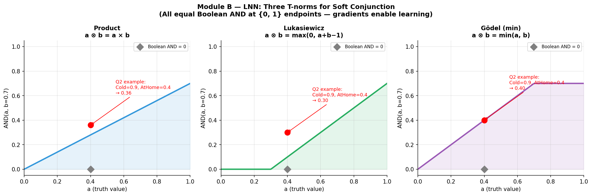

# Logic Neural Networks (LNN) & Differentiable Logic

## 🎯 Exam Importance
🔴 **必考** | Sample Test Q2: **4 marks = 20%**

---

## 📖 Core Concepts

| Term | 中文 | Definition |
|------|------|-----------|
| Logic Neural Network / LNN（逻辑神经网络） | 逻辑神经网络 | A neural network where each neuron represents a logical operator, operating on real-valued truth values [0,1] |
| Real-valued Logic（实值逻辑） | 实值逻辑 | Logic where truth values are continuous in [0,1] instead of just {0, 1} |
| Lukasiewicz Logic（Łukasiewicz逻辑） | 卢卡西维茨逻辑 | A specific many-valued logic used in LNN; AND = $\max(0, a+b-1)$ |
| T-norm（三角范数） | 三角范数 | A function that generalises AND to continuous values |
| Truth Bounds（真值上下界） | 真值界 | Each proposition has bounds $[L, U]$ where $L \le$ true value $\le U$ |
| Upward Pass（上行传播） | 上行传播 | Information flows from inputs to conclusion (like forward chaining) |
| Downward Pass（下行传播） | 下行传播 | Information flows from conclusion back to premises (like backward chaining) |

---

## 🧠 Feynman Draft — Learning From Scratch

Imagine you have a light switch that's either ON or OFF — that's classical Boolean logic. Now imagine a **dimmer switch** that can be at any brightness from 0% to 100%. That's what LNN does to logic.

In regular Boolean logic, "It is cold" is either TRUE (1) or FALSE (0). But in the real world, a temperature of 12°C isn't clearly "cold" or "not cold" — it's *somewhat* cold, maybe 0.6 out of 1.0.

**LNN keeps the structure of logical rules** (IF cold AND at home THEN heat on) **but replaces the hard switches with dimmer switches**. Each logical operator (AND, OR, NOT) becomes a smooth, differentiable function that works with any value between 0 and 1.

**Why does this matter?** Because if operators are smooth and differentiable, we can use **gradient descent** to learn the best parameters — just like training a neural network! We get the interpretability of logic AND the learning power of neural networks.

### Toy Example

**Boolean logic:**
- Cold = TRUE (1), AtHome = FALSE (0)
- AND(1, 0) = 0 → Heating OFF

**LNN (product t-norm):**
- Cold = 0.9, AtHome = 0.4
- AND(0.9, 0.4) = 0.9 × 0.4 = 0.36 → Heating is "36% recommended"

See how LNN gives a nuanced answer instead of a binary switch?

> ⚠️ **Common Misconception**: Students think LNN is just "fuzzy logic with neural networks." LNN is MORE than fuzzy logic — it maintains **logical soundness** (proven theorems about consistency) and uses **bidirectional inference** (both upward AND downward passes). Plain fuzzy logic doesn't have these properties.

> 💡 **Core Intuition**: LNN replaces Boolean {0,1} switches with smooth [0,1] dimmers, keeping logical structure while enabling gradient-based learning.

---

## 📐 Formal Definitions

### The Three T-norms You Must Know

Each t-norm defines how to compute AND for real-valued inputs $a, b \in [0, 1]$:

| T-norm | AND formula | NOT formula | OR formula |
|--------|-----------|------------|-----------|
| **Product** | $a \times b$ | $1 - a$ | $a + b - ab$ |
| **Lukasiewicz** | $\max(0, a + b - 1)$ | $1 - a$ | $\min(1, a + b)$ |
| **Godel (min/max)** | $\min(a, b)$ | $1 - a$ | $\max(a, b)$ |

### Quick Reference — Computing AND(0.9, 0.4)



| T-norm | Calculation | Result |
|--------|------------|--------|
| Product | $0.9 \times 0.4$ | **0.36** |
| Lukasiewicz | $\max(0, 0.9 + 0.4 - 1)$ | **0.30** |
| Godel | $\min(0.9, 0.4)$ | **0.40** |

> The sample test answer uses the **product t-norm**. But know all three — the actual test might use any.

### LNN Architecture

In LNN, the logical formula becomes a **computation graph**:

```
     [HeatingOn]         ← output node
          |
      [AND (⊗)]          ← conjunction neuron (differentiable)
        /     \
   [Cold]    [AtHome]     ← input propositions (real-valued)
    0.9        0.4
```

Each node computes a smooth function. The $\otimes$ operator is a **weighted** t-norm:

$$\text{AND}_w(a, b) = f(w_1 \cdot a, w_2 \cdot b)$$

where $f$ is a chosen t-norm and $w_1, w_2$ are learnable weights.

### Truth Bounds [L, U]

LNN doesn't just output a single number — it maintains **bounds** on each proposition:

- $[L, U]$ where $L \le$ true value $\le U$
- $L = U$ means we are certain of the exact truth value
- Wide gap means uncertainty

**Example:**
- Cold = $[0.8, 1.0]$ → "we're fairly sure it's cold, at least 0.8"
- AtHome = $[0.3, 0.5]$ → "somewhat uncertain if anyone's home"

### Bidirectional Inference

**Upward pass** (input → output): Given Cold and AtHome, compute HeatingOn.

**Downward pass** (output → input): Given that HeatingOn should be at least 0.7, what constraints does this place on Cold and AtHome?

This is like logical forward chaining AND backward chaining happening simultaneously.

```
UPWARD:  Cold=0.9, AtHome=0.4  →  HeatingOn ≈ 0.36
DOWNWARD: HeatingOn ≥ 0.7       →  Need both Cold and AtHome to be higher!
```

---

## 🔄 Worked Examples

### Example 1: Sample Test Q2 — Full Solution

**Rule:** HeatingOn $\leftarrow$ Cold $\otimes$ AtHome

**(a)** Natural language meaning and difference from Boolean:

> "If it is cold AND someone is at home, then the heating system should be turned on."
>
> In standard Boolean logic, both Cold and AtHome must be strictly True (= 1) for the rule to fire. In LNN, the $\otimes$ operator is a differentiable soft conjunction over continuous truth values. It accepts partial inputs (like Cold = 0.9, AtHome = 0.4) and produces an intermediate activation (like 0.36), reflecting degrees of truth. This enables gradient-based learning while preserving logical structure.

**(b)** Compute HeatingOn with Cold = 0.9, AtHome = 0.4:

> Using the product t-norm: HeatingOn = $0.9 \times 0.4 = 0.36$.
>
> Whether the system activates heating depends on a classification threshold. If the threshold is low (e.g., 0.3), HeatingOn = 0.36 > 0.3, so heating turns on. If the threshold is high (e.g., 0.7), HeatingOn = 0.36 < 0.7, so heating stays off.

### Example 2: LNN NOT and OR

Given: $\text{Danger} = 0.8$

**NOT (negation):**
$$\neg \text{Danger} = 1 - 0.8 = 0.2$$
Interpretation: "It is safe to degree 0.2" — makes sense!

**OR (with another input $\text{Fire} = 0.6$):**

| T-norm | OR formula | Result |
|--------|-----------|--------|
| Product-dual | $0.8 + 0.6 - 0.8 \times 0.6$ | **0.92** |
| Lukasiewicz | $\min(1, 0.8 + 0.6)$ | **1.0** |
| Godel | $\max(0.8, 0.6)$ | **0.8** |

### Example 3: Weighted LNN Operator

In real LNN, the AND operator has learnable weights:

$$\text{wAND}(a, b) = \max(0, w_1 a + w_2 b - 1)$$ (weighted Lukasiewicz)

If $w_1 = 1.0$ and $w_2 = 0.5$ (AtHome matters less):

$$\text{HeatingOn} = \max(0, 1.0 \times 0.9 + 0.5 \times 0.4 - 1) = \max(0, 0.9 + 0.2 - 1) = \max(0, 0.1) = 0.1$$

If $w_1 = 0.8$ and $w_2 = 1.0$ (AtHome matters more):

$$\text{HeatingOn} = \max(0, 0.8 \times 0.9 + 1.0 \times 0.4 - 1) = \max(0, 0.72 + 0.4 - 1) = \max(0, 0.12) = 0.12$$

> The weights are **learned from data** using gradient descent, so LNN can tune which inputs matter more.

---

## ⚖️ Trade-offs & Comparisons

### Boolean Logic vs Fuzzy Logic vs LNN

| Aspect | Boolean Logic | Fuzzy Logic | LNN |
|--------|-------------|-------------|-----|
| **Truth values** | {0, 1} | [0, 1] | [0, 1] with bounds [L, U] |
| **Operators** | Crisp AND/OR/NOT | min/max/complement | Differentiable t-norms |
| **Learning** | No learning | Manual rule design | Gradient-based weight learning |
| **Inference** | Forward OR backward | Forward only | **Bidirectional** (both) |
| **Soundness** | Proven sound | No formal guarantees | Proven logically sound |
| **Use case** | Theorem proving | Control systems | Neural-symbolic AI |

### Why Not Just Use a Regular Neural Network?

| Aspect | Regular Neural Net | LNN |
|--------|-------------------|-----|
| **Interpretability** | Black box | Every neuron has logical meaning |
| **Structure** | Arbitrary architecture | Architecture follows logical formula |
| **Knowledge** | Learned from data only | Can encode known rules + learn from data |
| **Small data** | Needs lots of data | Works with rules + small data |

---

## 🏗️ Design Question Framework

If asked "Design an LNN system for [scenario]":

1. **WHAT**: Define propositions and their meaning (e.g., Cold, AtHome)
2. **WHY**: LNN is needed because inputs are uncertain/partial; we want gradient learning + logical interpretability
3. **HOW**: Write the logical rule, choose a t-norm, show how to compute output from inputs
4. **TRADE-OFF**: Product t-norm is smooth but can vanish (many inputs multiplied → small); Lukasiewicz is bounded but has flat regions; Godel (min) is simple but not smooth
5. **EXAMPLE**: Plug in specific numbers and compute

---

## 📝 Practice Problems

### Practice 1: Compute with Lukasiewicz

Given: $\text{Fever} = 0.7$, $\text{Cough} = 0.8$

Rule: $\text{Sick} \leftarrow \text{Fever} \otimes \text{Cough}$

Compute Sick using each t-norm.

<details>
<summary>Answer</summary>

- **Product**: $0.7 \times 0.8 = 0.56$
- **Lukasiewicz**: $\max(0, 0.7 + 0.8 - 1) = \max(0, 0.5) = 0.5$
- **Godel**: $\min(0.7, 0.8) = 0.7$

</details>

### Practice 2: NOT and OR

Given: $A = 0.3$, $B = 0.9$

Compute $\neg A$, $A \vee B$ (using Lukasiewicz).

<details>
<summary>Answer</summary>

- $\neg A = 1 - 0.3 = 0.7$
- $A \vee B = \min(1, 0.3 + 0.9) = \min(1, 1.2) = 1.0$

</details>

### Practice 3: Explain the difference (exam-style)

"Explain why LNN uses a differentiable conjunction operator instead of standard Boolean AND."

<details>
<summary>Model Answer</summary>

Standard Boolean AND maps {0,1} × {0,1} → {0,1} and is a step function — it has zero gradient almost everywhere, making gradient-based optimization impossible. LNN's differentiable conjunction (e.g., product: $a \times b$) is smooth and continuous over [0,1], allowing backpropagation to adjust weights. This means the system can learn from data while preserving the logical structure of rules. Additionally, continuous truth values can represent partial or uncertain information more faithfully than binary values.

</details>

---

## 🌐 English Expression Tips

### Useful Exam Phrases
- "In LNN, each logical connective is implemented as a differentiable real-valued function, enabling gradient-based learning."
- "Unlike Boolean logic, which requires inputs to be strictly 0 or 1, LNN operates over continuous truth values in the interval [0, 1]."
- "The key advantage of LNN is that it combines the interpretability of symbolic logic with the learning capability of neural networks."
- "The truth value of the conjunction is computed using a t-norm, such as the product ($a \times b$) or Lukasiewicz ($\max(0, a + b - 1)$)."

### Commonly Confused
| Pair | Clarification |
|------|-------------|
| LNN vs Fuzzy Logic | LNN has learnable weights, bidirectional inference, and logical soundness guarantees. Fuzzy logic is manually designed. |
| t-norm vs activation function | t-norm generalises AND to [0,1]; activation function (ReLU, sigmoid) is a general nonlinearity in neural nets |
| "Differentiable" vs "continuous" | Differentiable means we can compute gradients — essential for backpropagation |

---

## ✅ Self-Test Checklist

- [ ] Can I compute AND, OR, NOT using all three t-norms (product, Lukasiewicz, Godel)?
- [ ] Can I explain in 2 sentences why LNN uses differentiable operators?
- [ ] Can I explain the difference between LNN and standard Boolean logic?
- [ ] Do I know what truth bounds [L, U] represent?
- [ ] Can I explain upward pass vs downward pass?
- [ ] Can I draw the LNN computation graph for a simple rule?
- [ ] Do I understand why weights in LNN operators are useful?
