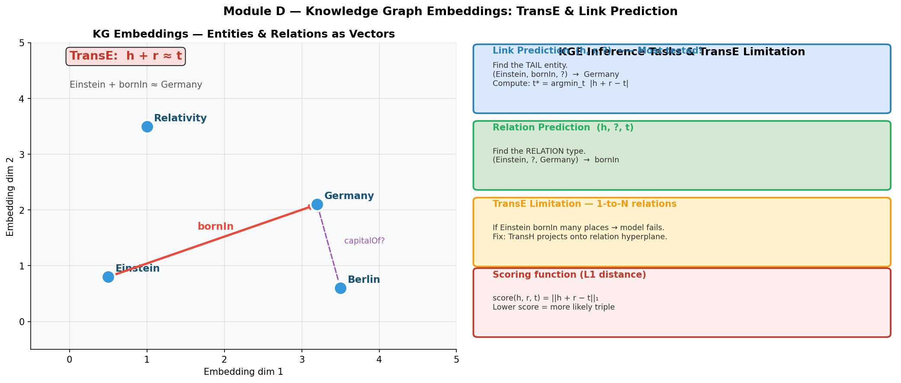

# Knowledge Graphs for AI — Construction, Inference & TransE

## 🎯 考试重要度

🟠 **高频** | Week 3 Lecture 2 核心内容 | Sample Test Q3 (2 marks) 直接考查 KG Embeddings 计算

> **Exam alert:** Q3 asks you to explain Knowledge Graph Embeddings and give a common KG inference task.
> You **must** know the TransE formula and be able to compute L1 distances by hand.

---

## 📖 核心概念（Core Concepts）

| English Term | 中文 | One-line Definition |
|---|---|---|
| Knowledge Graph (KG)（知识图谱） | 知识图谱 | A directed graph where nodes are entities and labeled edges are relations, storing facts as triples $(h, r, t)$ |
| Entity Extraction（实体抽取） | 实体抽取 | NLP task that identifies real-world entities (people, places, concepts) from unstructured text |
| Relation Extraction（关系抽取） | 关系抽取 | NLP task that identifies semantic relationships between extracted entities |
| Knowledge Integration（知识融合） | 知识融合 | Merging entities from different sources that refer to the same real-world object (entity resolution) |
| Property Graph（属性图） | 属性图 | Graph model where nodes and edges can carry key-value attributes (Neo4j model) |
| Triple Store / RDF Store（三元组存储） | 三元组存储 | Database that stores knowledge as (Subject, Predicate, Object) triples, queried via SPARQL |
| TransE | TransE | KG embedding model: for a true triple $(h, r, t)$, the relation $r$ acts as a translation so $\mathbf{h} + \mathbf{r} \approx \mathbf{t}$ |
| Negative Sampling（负采样） | 负采样 | Creating false triples by corrupting head or tail of a known true triple, used for contrastive training |
| Link Prediction（链接预测） | 链接预测 | Predicting the missing entity in an incomplete triple: $(h, r, ?)$ or $(?, r, t)$ |
| RAG (Retrieval-Augmented Generation)（检索增强生成） | 检索增强生成 | Architecture that retrieves external knowledge at inference time to ground LLM responses in facts |
| BM25 | BM25 | Sparse (keyword-based) retrieval scoring function used in traditional information retrieval |
| DPR (Dense Passage Retrieval)（稠密段落检索） | 稠密段落检索 | Neural retrieval model that encodes queries and passages as dense vectors for semantic similarity search |
| FAISS | FAISS | Facebook AI Similarity Search — a library for efficient approximate nearest neighbor search over dense vectors |

---

## 🧠 费曼草稿（Feynman Draft）

### Part 1: What Is a Knowledge Graph?

Imagine a gigantic web of sticky notes connected by labeled strings. Each sticky note is a *thing* in the world — Paris, France, Europe, Albert Einstein. Each string has a label telling you *how* those things are related — "located_in", "born_in", "part_of". That web of sticky notes and labeled strings is a Knowledge Graph.

Formally, every fact in the KG is a **triple**: (Paris, located_in, France). The first element is the **head entity** ($h$), the label on the string is the **relation** ($r$), and the other end is the **tail entity** ($t$).

Why not just use a regular database table? Because relationships are first-class citizens in a KG. You can walk from Paris → France → Europe in two hops, discovering that Paris is (transitively) in Europe — something a flat table cannot express naturally.

### Part 2: Building a Knowledge Graph

How do you fill that web with facts? Three steps:

1. **Entity Extraction** — Read a sentence like "Albert Einstein was born in Ulm, Germany." An NER (Named Entity Recognition) model tags "Albert Einstein" as a Person and "Ulm" and "Germany" as Locations.

2. **Relation Extraction** — A relation extraction model reads the sentence and outputs (Albert Einstein, born_in, Ulm) and (Ulm, located_in, Germany).

3. **Knowledge Integration** — Different sources may call the same person "A. Einstein", "Albert Einstein", or "Einstein, A." Entity resolution merges these into a single node.

### Part 3: How Do Machines Reason Over the Graph?

Three families of inference:

- **Rule-based**: You write explicit rules. "IF (X, part_of, Y) AND (Y, part_of, Z) THEN (X, part_of, Z)." The system applies them mechanically.
- **Path-based**: The system walks the graph. To answer "Is Paris in Europe?", it finds the path Paris → located_in → France → part_of → Europe. Path exists, answer yes.
- **Embedding-based**: This is where TransE lives. You convert every entity and every relation into a list of numbers (a vector). Then you do *arithmetic* on those vectors to predict missing facts.

### Part 4: TransE — The Key Idea



Think of it like this: relations are *movements in space*. If Paris is at position (0.5, 0.2, 0.7) and the movement "located_in" is (0.3, 0.2, 0.3), then after you apply that movement you should land at France's position. Let's check:

$$\mathbf{h} + \mathbf{r} = (0.5 + 0.3,\ 0.2 + 0.2,\ 0.7 + 0.3) = (0.8,\ 0.4,\ 1.0)$$

Now compare this predicted point to the actual positions of candidate entities:

| Candidate | Embedding | L1 Distance from (0.8, 0.4, 1.0) |
|---|---|---|
| **France** | (0.8, 0.4, 1.0) | $|0.8-0.8| + |0.4-0.4| + |1.0-1.0| = \mathbf{0.0}$ |
| Europe | (0.9, 0.3, 1.2) | $|0.8-0.9| + |0.4-0.3| + |1.0-1.2| = 0.1 + 0.1 + 0.2 = \mathbf{0.4}$ |
| Germany | (1.2, 0.6, 1.5) | $|0.8-1.2| + |0.4-0.6| + |1.0-1.5| = 0.4 + 0.2 + 0.5 = \mathbf{1.1}$ |

**France wins with distance 0.0.** The model correctly predicts (Paris, located_in, France).

The beauty: you never told the model any rules. It *learned* that "located_in" means "move by (0.3, 0.2, 0.3)" just from seeing thousands of (city, located_in, country) examples.

### Part 5: What About RAG?

Now zoom out. You have a Knowledge Graph full of facts, and a user asks an LLM a question. The LLM might hallucinate（产生幻觉）. RAG fixes this by inserting a retrieval step:

```
User asks: "What country is Paris in?"
    ↓
Step 1: Retrieve from KG: (Paris, located_in, France)
    ↓
Step 2: Feed to LLM: "Given that Paris is located in France, answer the question..."
    ↓
Step 3: LLM outputs a grounded, factual answer
```

The LLM's weights are never changed — you just give it better context.

---

⚠️ **Common Misconception**: Students often think TransE *proves* that a fact is true. It does not. TransE gives a *score* (distance). A low score means the triple is *likely* true based on learned patterns. It is probabilistic, not logical.

⚠️ **Common Misconception**: RAG does **not** retrain or fine-tune the LLM. It only provides additional context at inference time. The LLM parameters remain frozen.

💡 **Core Intuition**: TransE treats relations as translations in vector space — add the relation vector to the head, and you should land near the tail.

---

## 📐 正式定义（Formal Definition）

### Knowledge Graph

A Knowledge Graph is a tuple $\mathcal{G} = (E, R, T)$ where:
- $E$ = set of entities (nodes)
- $R$ = set of relation types (edge labels)
- $T \subseteq E \times R \times E$ = set of triples (directed, labeled edges representing facts)

### TransE Scoring Function

For a triple $(h, r, t)$, the energy (score) function is:

$$f(h, r, t) = \|\mathbf{h} + \mathbf{r} - \mathbf{t}\|_{p}$$

where $p = 1$ for L1 norm (Manhattan distance) or $p = 2$ for L2 norm (Euclidean distance).

- **Low** $f(h,r,t)$ → triple is likely **true**
- **High** $f(h,r,t)$ → triple is likely **false**

**L1 norm (Manhattan distance):**
$$\|\mathbf{h} + \mathbf{r} - \mathbf{t}\|_1 = \sum_{i=1}^{d} |h_i + r_i - t_i|$$

**L2 norm (Euclidean distance):**
$$\|\mathbf{h} + \mathbf{r} - \mathbf{t}\|_2 = \sqrt{\sum_{i=1}^{d} (h_i + r_i - t_i)^2}$$

### Margin-Based Ranking Loss

$$\mathcal{L} = \sum_{(h,r,t) \in S}\ \sum_{(h',r,t') \in S'_{(h,r,t)}} \max\!\Big(0,\ \gamma + f(h,r,t) - f(h',r,t')\Big)$$

where:
- $S$ = set of known true triples (positive examples)
- $S'_{(h,r,t)}$ = set of corrupted triples generated from $(h,r,t)$ (negative examples)
- $\gamma > 0$ = margin hyperparameter (separation gap between positive and negative scores)
- Goal: push $f(\text{positive})$ **down** and $f(\text{negative})$ **up**, with at least $\gamma$ gap

### Negative Sampling (Corruption)

Given a true triple $(h, r, t)$, generate negatives by:

- **Corrupt head**: replace $h$ with random $h' \in E$, yielding $(h', r, t)$
- **Corrupt tail**: replace $t$ with random $t' \in E$, yielding $(h, r, t')$

Constraint: the corrupted triple must **not** exist in $T$ (otherwise it is a valid fact, not a true negative).

---

## 🔄 机制与推导（How It Works）

### KG Construction Pipeline — Step by Step

```
Raw Text / Structured Data
        ↓
[Step 1] Entity Extraction (NER)
        "Paris is the capital of France" → {Paris, France}
        ↓
[Step 2] Relation Extraction
        → (Paris, capital_of, France)
        ↓
[Step 3] Knowledge Integration (Entity Resolution)
        "Paris" (source A) = "City of Paris" (source B) → merge
        ↓
[Step 4] Store in Graph Database
        ├── Neo4j (Property Graph, Cypher queries)
        ├── RDF Store (Triple Store, SPARQL queries)
        └── Dgraph (Distributed, GraphQL+)
```

### Graph Database Comparison

| Database | Model | Query Language | Best For |
|---|---|---|---|
| **Neo4j** | Property Graph (nodes/edges have attributes) | Cypher | Social networks, fraud detection, path queries |
| **RDF Store** (e.g., Virtuoso, Blazegraph) | Triple Store (Subject, Predicate, Object) | SPARQL | Open KGs (DBpedia, Wikidata), semantic web |
| **Dgraph** | Distributed Graph | GraphQL+ | Large-scale, real-time AI applications |

**Key distinction:** Property graphs allow key-value attributes on both nodes and edges. RDF triples are purely (S, P, O) — to attach metadata you need reification (making the triple itself an entity).

### Three Types of KG Inference

#### 1. Rule-Based Inference（基于规则的推理）

Apply explicit logical rules over the graph.

```
Rule: IF (X, part_of, Y) AND (Y, part_of, Z) THEN (X, part_of, Z)

Facts: (Auckland, part_of, New Zealand), (New Zealand, part_of, Oceania)
Infer: (Auckland, part_of, Oceania) ✅
```

Strengths: deterministic, interpretable, guaranteed sound (if rules are correct).
Weakness: requires manually written rules; cannot handle missing data.

#### 2. Path-Based Inference（基于路径的推理）

Traverse graph paths to discover implicit relationships.

```
Query: "Did Newton influence Einstein?"
Path found: Newton →[discovered]→ Law of Gravity →[influenced]→ 
            Theory of Relativity ←[developed]← Einstein
Answer: Yes — Newton's work indirectly influenced Einstein.
```

Strengths: uses graph structure directly; no training needed.
Weakness: only finds what is reachable; cannot generalize beyond existing edges.

#### 3. Embedding-Based Inference（基于嵌入的推理）

Represent entities and relations as dense vectors; predict missing facts via vector arithmetic.

**This is where TransE operates.** See the full TransE treatment below.

### TransE Training — Complete Process

**Step 1: Initialize embeddings**

Assign each entity $e \in E$ a random $d$-dimensional vector $\mathbf{e} \in \mathbb{R}^d$.
Assign each relation $r \in R$ a random $d$-dimensional vector $\mathbf{r} \in \mathbb{R}^d$.
Normalize all entity vectors to unit length: $\|\mathbf{e}\| = 1$.

**Step 2: Sample a mini-batch of true triples**

From the training set $T$, sample a batch of positive triples, e.g.:
- (Paris, located_in, France)
- (Berlin, located_in, Germany)
- (France, part_of, Europe)

**Step 3: Generate negative triples (corruption)**

For each positive triple $(h, r, t)$, create a negative by randomly replacing head or tail:
- (Paris, located_in, France) → corrupt tail → (Paris, located_in, **Germany**) [negative]
- (Berlin, located_in, Germany) → corrupt head → (**Tokyo**, located_in, Germany) [negative]

**Step 4: Compute scores**

For positive triple: $f^+ = \|\mathbf{h} + \mathbf{r} - \mathbf{t}\|$
For negative triple: $f^- = \|\mathbf{h'} + \mathbf{r} - \mathbf{t}\|$ (or $\|\mathbf{h} + \mathbf{r} - \mathbf{t'}\|$)

We want $f^+$ to be small and $f^-$ to be large.

**Step 5: Compute margin loss and update**

$$\text{loss} = \max(0,\ \gamma + f^+ - f^-)$$

If $f^- - f^+ > \gamma$, the loss is zero (good separation).
Otherwise, adjust embeddings via gradient descent to push $f^+$ down and $f^-$ up.

**Step 6: Normalize entity embeddings**

After each gradient step, re-normalize entity vectors to prevent embedding magnitudes from exploding.

**Step 7: Repeat** until convergence.

### TransE Inference — Worked Example (Lecture Slides 45-46)

> **This exact computation style appears in Sample Test Q3. Practice until automatic.**

**Setup:**

Known facts:
- (Paris, located_in, France)
- (France, part_of, Europe)

Pre-trained embeddings ($d = 3$):

| Entity | Embedding Vector |
|---|---|
| Paris | $(0.5, 0.2, 0.7)$ |
| France | $(0.8, 0.4, 1.0)$ |
| Europe | $(0.9, 0.3, 1.2)$ |
| Germany | $(1.2, 0.6, 1.5)$ |

| Relation | Embedding Vector |
|---|---|
| located_in | $(0.3, 0.2, 0.3)$ |

**Query:** (Paris, located_in, ?) — Which entity is Paris located in?

**Step 1:** Compute $\mathbf{h} + \mathbf{r}$:

$$\mathbf{h} + \mathbf{r} = (0.5, 0.2, 0.7) + (0.3, 0.2, 0.3) = (0.8, 0.4, 1.0)$$

**Step 2:** Compute L1 distance to each candidate entity:

$$d(\text{France}) = |0.8 - 0.8| + |0.4 - 0.4| + |1.0 - 1.0| = 0 + 0 + 0 = \mathbf{0.0}$$

$$d(\text{Europe}) = |0.8 - 0.9| + |0.4 - 0.3| + |1.0 - 1.2| = 0.1 + 0.1 + 0.2 = \mathbf{0.4}$$

$$d(\text{Germany}) = |0.8 - 1.2| + |0.4 - 0.6| + |1.0 - 1.5| = 0.4 + 0.2 + 0.5 = \mathbf{1.1}$$

**Step 3:** Rank by distance (ascending):

| Rank | Entity | L1 Distance |
|---|---|---|
| 1 | **France** | **0.0** |
| 2 | Europe | 0.4 |
| 3 | Germany | 1.1 |

**Answer: France** (smallest L1 distance = 0.0). The model predicts (Paris, located_in, **France**).

---

## TransE Limitations & Extensions

### Why TransE Struggles

TransE's core equation $\mathbf{h} + \mathbf{r} = \mathbf{t}$ means that for a given relation $r$ and tail $t$, there is exactly **one** ideal head vector: $\mathbf{h} = \mathbf{t} - \mathbf{r}$.

This causes problems with **1-to-N, N-to-1, and N-to-N relations**:

**Example (N-to-1):** (Paris, located_in, France), (Lyon, located_in, France), (Marseille, located_in, France).

TransE requires: $\mathbf{Paris} + \mathbf{r} \approx \mathbf{France}$, $\mathbf{Lyon} + \mathbf{r} \approx \mathbf{France}$, $\mathbf{Marseille} + \mathbf{r} \approx \mathbf{France}$.

This forces $\mathbf{Paris} \approx \mathbf{Lyon} \approx \mathbf{Marseille}$ — all three cities collapse to the same point! They lose their distinct identities.

### Extensions Beyond TransE

| Model | Key Idea | How It Handles N-to-N |
|---|---|---|
| **TransE** | $\mathbf{h} + \mathbf{r} \approx \mathbf{t}$ | Cannot — entities collapse |
| **TransH** | Projects $h, t$ onto a relation-specific **hyperplane** before translation | Different projections allow same entity to have different representations per relation |
| **TransR** | Projects $h, t$ into a **relation-specific space** via matrix $\mathbf{M}_r$ | Each relation has its own subspace; entities can differ across relations |
| **ComplEx** | Uses **complex-valued** embeddings with Hermitian dot product | Naturally models asymmetric relations; handles N-to-N via complex arithmetic |

**TransH in more detail:**
- Each relation $r$ has a normal vector $\mathbf{w}_r$ defining a hyperplane
- Project entities onto the hyperplane: $\mathbf{h}_\perp = \mathbf{h} - \mathbf{w}_r^\top \mathbf{h} \cdot \mathbf{w}_r$
- Score: $f(h,r,t) = \|\mathbf{h}_\perp + \mathbf{r} - \mathbf{t}_\perp\|$
- Benefit: Paris, Lyon, Marseille can project to different points on the "located_in" hyperplane while keeping distinct embeddings in the full space

**TransR in more detail:**
- Each relation $r$ has a projection matrix $\mathbf{M}_r \in \mathbb{R}^{k \times d}$
- Project entities: $\mathbf{h}_r = \mathbf{M}_r \mathbf{h}$, $\mathbf{t}_r = \mathbf{M}_r \mathbf{t}$
- Score: $f(h,r,t) = \|\mathbf{h}_r + \mathbf{r} - \mathbf{t}_r\|$
- More expressive than TransH but requires more parameters ($\mathbf{M}_r$ per relation)

---

## ⚖️ 权衡分析（Trade-offs & Comparisons）

### KG Inference Methods Compared

| Feature | Rule-Based | Path-Based | Embedding-Based (TransE etc.) |
|---|---|---|---|
| **Approach** | Apply logical rules (IF-THEN) | Traverse graph paths | Vector arithmetic |
| **Can predict missing facts?** | No — only derives from existing facts | No — only follows existing edges | **Yes** — core strength |
| **Interpretability** | High (readable rules) | Medium (explainable paths) | Low (opaque vectors) |
| **Scalability** | Poor (rule explosion) | Medium (path search is expensive) | Good (matrix operations, GPU-friendly) |
| **Requires training?** | No | No | Yes (learn embeddings) |
| **Handles noise?** | Poorly (brittle) | Poorly | Well (statistical patterns) |

### TransE vs TransH vs TransR

| Aspect | TransE | TransH | TransR |
|---|---|---|---|
| **Relation modeling** | Single translation vector | Translation on hyperplane | Translation in relation-specific space |
| **Parameters per relation** | $d$ (one vector) | $2d$ (vector + normal) | $d + k \times d$ (vector + matrix) |
| **1-to-1 relations** | Excellent | Excellent | Excellent |
| **1-to-N / N-to-1** | Poor (entity collapse) | Good (different projections) | Good (relation-specific projections) |
| **N-to-N relations** | Poor | Moderate | Good |
| **Training speed** | Fast (fewest parameters) | Moderate | Slow (matrix per relation) |
| **When to use** | Simple KGs, 1-to-1 dominant | Medium KGs, mixed cardinalities | Complex KGs, many N-to-N relations |

### Graph Database Comparison

| Feature | Neo4j (Property Graph) | RDF Store (Triple Store) | Dgraph |
|---|---|---|---|
| **Data model** | Nodes & edges with key-value properties | (Subject, Predicate, Object) triples | Distributed property graph |
| **Query language** | Cypher | SPARQL | GraphQL+ |
| **Schema** | Schema-optional | Schema via ontology (OWL/RDFS) | Schema via GraphQL types |
| **Strengths** | Intuitive, rich node/edge attributes | Standards-based, interoperable, ontology support | Horizontally scalable, real-time |
| **Weaknesses** | Single-machine scaling limits | Verbose, complex queries | Smaller ecosystem |
| **Best for** | Social networks, fraud detection | Semantic web, open KGs (Wikidata) | Large-scale AI-powered applications |

### RAG vs Fine-Tuning vs Vanilla LLM

| Aspect | Vanilla LLM | Fine-Tuned LLM | RAG |
|---|---|---|---|
| **Knowledge source** | Training data only | Training data + fine-tuning data | Training data + retrieved documents at inference |
| **Up-to-date knowledge?** | No (static cutoff) | Partially (depends on fine-tune data) | **Yes** (real-time retrieval) |
| **Hallucination risk** | High | Medium | **Low** (grounded in retrieved facts) |
| **Cost to update knowledge** | Full retraining | Fine-tuning run | Update retrieval index only |
| **Latency** | Low | Low | Higher (retrieval step added) |

---

## 🏗️ 设计题答题框架

### Prompt: "Design a knowledge-based system that uses KG embeddings to recommend research papers."

**WHAT:** "I would design a system that constructs a Knowledge Graph of papers, authors, topics, and citations, then uses TransE-family embeddings for link prediction to discover relevant but undiscovered connections, with a RAG pipeline to generate natural-language explanations."

**WHY:** "A KG captures structured relationships (author-wrote-paper, paper-cites-paper, paper-covers-topic) that collaborative filtering alone misses. Embeddings enable prediction of missing links (e.g., papers a researcher *should* read but hasn't cited)."

**HOW:**
1. **KG Construction**: Extract entities (papers, authors, topics) from metadata + NLP on abstracts. Relations: wrote, cites, covers_topic, affiliated_with.
2. **Storage**: Use Neo4j for rich property attributes (publication year, citation count on edges).
3. **Embedding Training**: Train TransR (not TransE — because "covers_topic" is N-to-N: many papers cover the same topic). Optimize margin-based ranking loss.
4. **Inference**: For researcher $R$, compute $\mathbf{R} + \mathbf{should\_read}$ and rank all papers by L1 distance. Top-k = recommendations.
5. **RAG layer**: User asks "Why is this paper relevant?" → retrieve related KG triples → LLM generates natural-language explanation grounded in facts.

**TRADE-OFF:**
- TransE is simpler and faster but would collapse papers covering the same topic → choose TransR for expressiveness at the cost of more parameters.
- Neo4j offers rich property storage but single-machine limits → if scale demands, migrate to Dgraph.
- RAG adds latency but eliminates "black box" recommendations.

**EXAMPLE:** "Researcher studies 'attention mechanisms'. KG link prediction finds (Researcher, should_read, 'FlashAttention paper') with low distance score. RAG retrieves: (FlashAttention, improves, Transformer efficiency), (Researcher, studies, Attention) → LLM explains: 'This paper is relevant because it improves the efficiency of the attention mechanisms you study.'"

---

## 📝 历年真题 + 练习题

### Sample Test Q3 (2 marks) — Original

> **Explain Knowledge Graph Embeddings and give a common KG inference task.**

**Model answer (2-mark level):**

Knowledge Graph Embeddings represent entities and relations as dense vectors in a continuous space. Models like TransE learn these vectors such that for a true triple $(h, r, t)$, the relationship $\mathbf{h} + \mathbf{r} \approx \mathbf{t}$ holds. This enables the system to predict missing facts via vector arithmetic rather than explicit graph traversal.

A common inference task is **Link Prediction**: given an incomplete triple $(h, r, ?)$, compute $\mathbf{h} + \mathbf{r}$ and find the entity $t^*$ whose embedding is nearest (by L1 or L2 distance). For example, (Einstein, born_in, ?) → compute $\mathbf{h} + \mathbf{r}$ → nearest entity = Germany.

---

### Practice Problem — TransE Computation (exam-style)

> **Given the following entity and relation embeddings, predict the missing entity.**
>
> Entity embeddings ($d = 4$):
> - Tokyo → $(0.1, 0.5, 0.3, 0.8)$
> - Japan → $(0.4, 0.7, 0.6, 1.1)$
> - China → $(0.6, 0.9, 0.5, 1.3)$
> - Seoul → $(0.2, 0.4, 0.4, 0.9)$
> - South Korea → $(0.5, 0.6, 0.7, 1.2)$
>
> Relation embedding:
> - capital_of → $(0.3, 0.2, 0.3, 0.3)$
>
> **Query: (Tokyo, capital_of, ?)**
>
> Compute $\mathbf{h} + \mathbf{r}$ and find the entity with the smallest L1 distance.

<details>
<summary><strong>Click to reveal solution</strong></summary>

**Step 1:** Compute $\mathbf{h} + \mathbf{r}$:

$$\mathbf{Tokyo} + \mathbf{capital\_of} = (0.1 + 0.3,\ 0.5 + 0.2,\ 0.3 + 0.3,\ 0.8 + 0.3) = (0.4,\ 0.7,\ 0.6,\ 1.1)$$

**Step 2:** Compute L1 distances:

- **Japan** $(0.4, 0.7, 0.6, 1.1)$: $|0.4-0.4| + |0.7-0.7| + |0.6-0.6| + |1.1-1.1| = \mathbf{0.0}$
- China $(0.6, 0.9, 0.5, 1.3)$: $0.2 + 0.2 + 0.1 + 0.2 = \mathbf{0.7}$
- Seoul $(0.2, 0.4, 0.4, 0.9)$: $0.2 + 0.3 + 0.2 + 0.2 = \mathbf{0.9}$
- South Korea $(0.5, 0.6, 0.7, 1.2)$: $0.1 + 0.1 + 0.1 + 0.1 = \mathbf{0.4}$

**Step 3:** Rank:

| Rank | Entity | L1 Distance |
|---|---|---|
| 1 | **Japan** | **0.0** |
| 2 | South Korea | 0.4 |
| 3 | China | 0.7 |
| 4 | Seoul | 0.9 |

**Answer: Japan** (L1 distance = 0.0)

</details>

---

### Practice Problem 2 — Negative Sampling

> **Given the true triple (Berlin, located_in, Germany), generate two negative triples by corruption.**

<details>
<summary><strong>Click to reveal solution</strong></summary>

**Corrupt head:** Replace Berlin with a random entity:
- $(\textbf{Tokyo}, \text{located\_in}, \text{Germany})$ — false, Tokyo is not in Germany

**Corrupt tail:** Replace Germany with a random entity:
- $(\text{Berlin}, \text{located\_in}, \textbf{Japan})$ — false, Berlin is not in Japan

Important: verify that the corrupted triple does not accidentally appear in the known fact set $T$. If (Tokyo, located_in, Germany) happened to be a true fact, you would need to pick a different corruption.

</details>

---

### Practice Problem 3 — Conceptual (Short Answer)

> **Why does TransE fail for N-to-1 relations? Give a specific example.**

<details>
<summary><strong>Click to reveal solution</strong></summary>

TransE requires $\mathbf{h} + \mathbf{r} \approx \mathbf{t}$ for every true triple. For an N-to-1 relation like "located_in" where multiple heads map to the same tail:

- (Paris, located_in, France): $\mathbf{Paris} + \mathbf{r} \approx \mathbf{France}$
- (Lyon, located_in, France): $\mathbf{Lyon} + \mathbf{r} \approx \mathbf{France}$
- (Marseille, located_in, France): $\mathbf{Marseille} + \mathbf{r} \approx \mathbf{France}$

Since $\mathbf{r}$ is the same vector for all three, we get $\mathbf{Paris} \approx \mathbf{Lyon} \approx \mathbf{Marseille}$. The model collapses distinct entities into the same point, losing their individual identities. TransH solves this by projecting entities onto a relation-specific hyperplane, allowing different entities to occupy different projected positions even for the same relation.

</details>

---

## 🌐 英语表达要点（English Expression）

### Defining KG Embeddings (exam sentence starters)

```
"Knowledge Graph Embeddings map entities and relations to continuous 
 vector representations, enabling algebraic operations for inference 
 over incomplete knowledge graphs."

"TransE models each relation as a translation vector in embedding space, 
 such that for a valid triple (h, r, t), the equation h + r ≈ t holds."
```

### Explaining Link Prediction

```
"To predict the missing tail in (h, r, ?), we compute h + r and rank 
 all candidate entities by their L1 or L2 distance to this predicted 
 point. The entity with the smallest distance is the predicted answer."
```

### Describing RAG

```
"Retrieval-Augmented Generation addresses LLM hallucination by retrieving 
 relevant knowledge from external sources at inference time and injecting 
 it into the prompt as context, without modifying the model's parameters."
```

### Comparing Models

```
"While TransE is computationally efficient and works well for 1-to-1 
 relations, it struggles with N-to-N mappings because multiple entities 
 sharing the same relation and target collapse to identical embeddings."

"TransH addresses this limitation by introducing a relation-specific 
 hyperplane, allowing entities to have distinct projected representations 
 even when they share the same relation."
```

### 易错词汇

| Incorrect / Confused | Correct Usage | Note |
|---|---|---|
| "embedding" vs "encoding" | Embedding = learned vector; Encoding = deterministic transformation | TransE uses **embeddings** (trainable), not encodings |
| "predict" vs "infer" | Predict = estimate unknown; Infer = derive from given info | TransE **predicts** missing links; rule-based systems **infer** |
| "score" direction | Low score = **true** triple in TransE | Counterintuitive — students often assume high score = true |
| "negative sample" vs "false triple" | Negative sample = artificially corrupted for training | A negative sample might accidentally be true; check against $T$ |
| "graph" vs "knowledge graph" | KG = labeled directed graph with semantic meaning | Not all graphs are knowledge graphs |
| "retrieval" vs "generation" | Retrieval = find existing info; Generation = create new text | RAG combines **both** — retrieval feeds into generation |

---

## ✅ 自测检查清单

- [ ] Can you define a Knowledge Graph as $(E, R, T)$ and give 3 example triples?
- [ ] Can you explain the 3 steps of KG construction (entity extraction, relation extraction, knowledge integration)?
- [ ] Can you compare Neo4j (property graph) vs RDF Store (triple store) and state when to use each?
- [ ] Can you name and explain the 3 types of KG inference (rule-based, path-based, embedding-based)?
- [ ] Can you write the TransE scoring formula $f(h,r,t) = \|\mathbf{h} + \mathbf{r} - \mathbf{t}\|$ from memory?
- [ ] Can you compute $\mathbf{h} + \mathbf{r}$ and L1 distances to predict a missing entity by hand in under 2 minutes?
- [ ] Can you explain negative sampling — how to corrupt a triple and why we need it?
- [ ] Can you write the margin-based ranking loss and explain what $\gamma$ controls?
- [ ] Can you explain **why** TransE fails for N-to-1 relations with a concrete example?
- [ ] Can you describe how TransH fixes TransE's limitation (hyperplane projection)?
- [ ] Can you compare TransE, TransH, TransR, and ComplEx in a table?
- [ ] Can you draw the RAG pipeline (Query → Retrieve → Context → LLM → Response)?
- [ ] Can you explain the difference between RAG and fine-tuning in one sentence?
- [ ] Can you solve a TransE computation problem like Sample Test Q3 under exam conditions?
