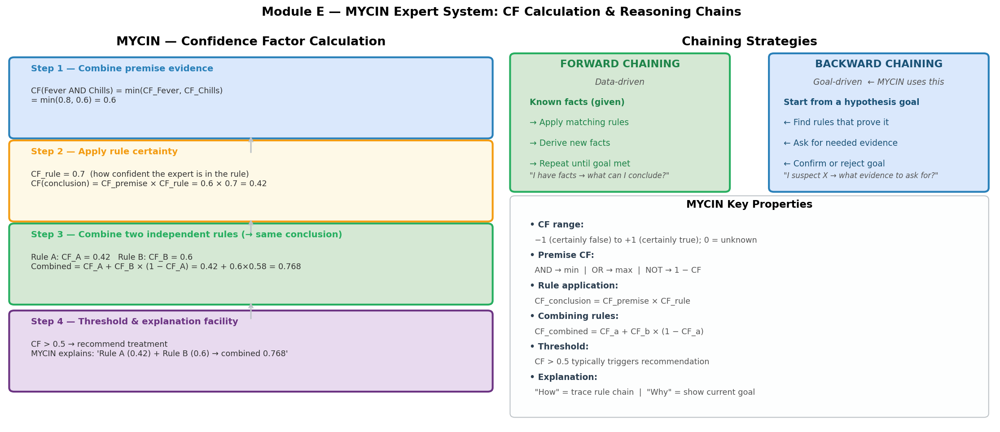

# MYCIN Expert System — Deep Dive (W4L1)

## 🎯 考试重要度
🟡 **中频 — 但正式考试很可能出现** | 整个 W4L1 专门讲 MYCIN，CF 计算是极易出计算题的考点

> MYCIN did not appear in the sample test, but an entire lecture was devoted to it. Confidence Factor calculations are **extremely testable** as short numerical questions. Backward chaining reasoning is a favourite topic for "explain with an example" questions.

---

## 📖 核心概念（Core Concepts）

| English Term | 中文 | One-line Definition |
|---|---|---|
| MYCIN | MYCIN 专家系统 | A rule-based expert system built at Stanford (1970s) to diagnose bacterial infections and recommend antibiotics |
| Backward Chaining（后向链接） | 后向链接 / 目标驱动推理 | Goal-driven inference: start from a hypothesis and work backward to find supporting evidence |
| Forward Chaining（前向链接） | 前向链接 / 数据驱动推理 | Data-driven inference: start from known facts and fire rules to derive new conclusions |
| Confidence Factor (CF)（置信因子） | 置信因子 | A numerical measure of certainty ranging from −1.0 (definitely false) to +1.0 (definitely true) |
| Knowledge Base (KB)（知识库） | 知识库 | The collection of 450+ IF-THEN production rules encoding medical expertise |
| Inference Engine（推理引擎） | 推理引擎 | The reasoning component that applies backward chaining over the rule base |
| Working Memory（工作记忆） | 工作记忆 | Current known facts about the patient being diagnosed |
| MONITOR（监控操作） | 监控 | Check if a fact is already present in working memory |
| FINDOUT（查询操作） | 查询 | Ask the user (clinician) to supply a missing piece of information |
| WHY Query（WHY 查询） | WHY 查询 | User asks "Why are you asking me this?" — system reveals its current reasoning goal |
| HOW Query（HOW 查询） | HOW 查询 | User asks "How did you reach that conclusion?" — system shows the rule chain |
| E-MYCIN (Essential MYCIN) | 通用 MYCIN 外壳 | Domain-independent expert system shell — MYCIN with medical knowledge removed, reusable for other domains |
| Knowledge Acquisition Bottleneck（知识获取瓶颈） | 知识获取瓶颈 | The fundamental difficulty of extracting and encoding expert knowledge into rules |

---

## 🧠 费曼草稿（Feynman Draft）



### The Junior Doctor with a Giant Manual

Imagine a **brand-new doctor** on their first day in the hospital. They have zero experience but someone hands them a thick manual — 450 pages of rules written by the best infectious disease specialist in the country. Each page says something like:

> "IF the patient has a high fever AND the blood culture grew gram-negative rods, THEN suspect E. coli infection (I'm about 70% sure)."

The junior doctor doesn't think creatively. They just follow the manual **backwards**: they start with a question ("What is causing this infection?"), look up which rules could answer it, then check whether they already know the required facts. If they don't know something, they either look it up in the patient's chart or ask the patient directly.

That's MYCIN. It's not intelligent in the human sense — it's a **systematic rule-follower** with a clever strategy for deciding what to ask.

### How Does the Junior Doctor Actually Work?

Let's walk through a tiny example. Suppose MYCIN's knowledge base has just three rules:

```
Rule 1: IF infection is primary-bacteremia
        AND culture-site is sterile-site
        THEN organism is E.coli  (CF = 0.8)

Rule 2: IF organism is E.coli
        THEN recommend drug Ampicillin  (CF = 0.9)

Rule 3: IF infection is primary-bacteremia
        AND patient-age > 60
        THEN organism is Klebsiella  (CF = 0.6)
```

**Goal**: "What drug should I recommend?"

**Step 1** — MYCIN looks for rules whose THEN part mentions a drug recommendation. It finds **Rule 2** (recommend Ampicillin if E.coli). But Rule 2 needs to know the organism. Is it E.coli? Unknown. So "organism is E.coli" becomes a **sub-goal**.

**Step 2** — Now MYCIN searches for rules whose THEN part concludes about the organism. It finds **Rule 1**. Rule 1 needs two things: (a) infection type and (b) culture site. MYCIN checks working memory (**MONITOR**). If unknown, it asks the clinician (**FINDOUT**): "What is the infection type?" The doctor answers: "primary-bacteremia (CF = 1.0)." "What is the culture site?" Answer: "sterile-site (CF = 0.9)."

**Step 3** — Now Rule 1 can fire:
- CF(premise) = min(1.0, 0.9) = 0.9 (because AND takes the minimum)
- CF(E.coli) = 0.9 × 0.8 = **0.72**

**Step 4** — Rule 2 can now fire:
- CF(Ampicillin) = 0.72 × 0.9 = **0.648**

MYCIN would report: "I recommend Ampicillin with confidence 0.648."

This is **backward chaining** — we started from the goal and worked backwards through the rule chain, only asking questions that were actually needed.

### What if Two Rules Support the Same Conclusion?

Suppose Rule 1 gives CF(E.coli) = 0.72 and another Rule 4 also concludes E.coli with CF = 0.5. We combine them:

$$CF_{combined} = 0.72 + 0.5 \times (1 - 0.72) = 0.72 + 0.14 = 0.86$$

Two independent pieces of evidence **reinforce** each other. Notice the combined CF is higher than either alone, but never reaches 1.0 from two uncertain pieces — that makes intuitive sense!

---

⚠️ **Common Misconception**: Students often multiply CFs when combining multiple rules for the same conclusion. That's WRONG. Multiplication is for chaining rules in sequence (premise CF × rule CF). The special **combination formula** $CF_1 + CF_2(1 - CF_1)$ is for when two different rules both support the same conclusion.

Another common mistake: confusing AND (take the **minimum**) with OR (take the **maximum**). Think of it this way — a chain is only as strong as its weakest link (AND = min), but you only need one good reason (OR = max).

---

💡 **Core Intuition**: MYCIN is a backward-chaining rule system that asks only necessary questions and propagates uncertainty through confidence factors.

---

## 📐 正式定义（Formal Definition）

### MYCIN Architecture

```
┌─────────────────────────────────────────────────────────┐
│                     MYCIN System                        │
│                                                         │
│  ┌─────────────────┐    ┌──────────────────────────┐    │
│  │  Knowledge Base  │    │     Working Memory       │    │
│  │  (450+ IF-THEN   │    │  (patient facts gathered │    │
│  │   production     │    │   during consultation)   │    │
│  │   rules)         │    │                          │    │
│  └────────┬─────────┘    └────────────┬─────────────┘    │
│           │                           │                  │
│    ┌──────┴───────────────────────────┴──────┐           │
│    │          Inference Engine               │           │
│    │   (Backward Chaining Controller)        │           │
│    │                                         │           │
│    │   MONITOR: check working memory         │           │
│    │   FINDOUT: ask the clinician            │           │
│    │   Rule evaluation + CF propagation      │           │
│    └──────────────────┬──────────────────────┘           │
│                       │                                  │
│    ┌──────────────────┴──────────────────────┐           │
│    │       Explanation Facility              │           │
│    │   WHY: "Why are you asking this?"       │           │
│    │   HOW: "How did you conclude that?"     │           │
│    └─────────────────────────────────────────┘           │
│                                                         │
│    ┌─────────────────────────────────────────┐           │
│    │        User Interface (CLI)             │           │
│    │   Clinician answers questions,          │           │
│    │   asks WHY/HOW, receives diagnosis      │           │
│    └─────────────────────────────────────────┘           │
└─────────────────────────────────────────────────────────┘
```

### Production Rule Format

```
IF   [condition₁] AND [condition₂] AND ...
THEN [conclusion] WITH CF [confidence_factor]
```

### Confidence Factor (CF) Formulas

**Range**: $CF \in [-1.0, +1.0]$

| Value | Meaning |
|---|---|
| $+1.0$ | Definitely true |
| $+0.7$ | Fairly confident |
| $0.0$ | No information (unknown) |
| $-0.7$ | Fairly confident it's false |
| $-1.0$ | Definitely false |

**Formula 1 — Conjunction (AND) of premises:**

$$CF(A \text{ AND } B) = \min(CF_A, \; CF_B)$$

> Intuition: a chain is only as strong as its weakest link.

**Formula 2 — Disjunction (OR) of premises:**

$$CF(A \text{ OR } B) = \max(CF_A, \; CF_B)$$

> Intuition: you only need one good reason to believe.

**Formula 3 — Rule application (premise → conclusion):**

$$CF(\text{conclusion}) = CF(\text{premise}) \times CF(\text{rule})$$

> Intuition: uncertainty compounds when you reason through a rule.

**Formula 4 — Combining multiple rules for the same conclusion (both positive):**

$$CF_{combined} = CF_1 + CF_2 \times (1 - CF_1)$$

> Intuition: independent evidence reinforces belief, but with diminishing returns.

**Formula 4b — Both negative:**

$$CF_{combined} = CF_1 + CF_2 \times (1 + CF_1)$$

**Formula 4c — One positive, one negative:**

$$CF_{combined} = \frac{CF_1 + CF_2}{1 - \min(|CF_1|, |CF_2|)}$$

> For the exam, the "both positive" case (Formula 4) is by far the most commonly tested.

---

## 🔄 机制与推导（How It Works）

### Backward Chaining — Step by Step

```
GOAL: Determine the identity of the organism

Step 1: Find rules whose THEN mentions "organism identity"
        → Rule 1, Rule 3 are candidates

Step 2: Try Rule 1:
        IF infection = primary-bacteremia  [Unknown → FINDOUT]
        AND site = sterile-site            [Unknown → FINDOUT]
        THEN organism = E.coli (CF=0.8)

Step 3: FINDOUT "infection type" → Clinician answers:
        "primary-bacteremia" (CF = 1.0) → store in Working Memory

Step 4: FINDOUT "culture site" → Clinician answers:
        "sterile-site" (CF = 0.9) → store in Working Memory

Step 5: Rule 1 fires:
        CF(premise) = min(1.0, 0.9) = 0.9
        CF(E.coli)  = 0.9 × 0.8 = 0.72

Step 6: Try Rule 3:
        IF infection = primary-bacteremia  [MONITOR: already known, CF=1.0]
        AND patient-age > 60              [Unknown → FINDOUT]
        THEN organism = Klebsiella (CF=0.6)

Step 7: FINDOUT "patient age" → Clinician answers:
        "age = 72" (CF = 1.0)

Step 8: Rule 3 fires:
        CF(premise) = min(1.0, 1.0) = 1.0
        CF(Klebsiella) = 1.0 × 0.6 = 0.6

Result: E.coli (CF=0.72) vs Klebsiella (CF=0.6)
        → Most likely: E.coli
```

Notice how MYCIN only asked three questions (infection type, culture site, patient age) — it didn't ask about every possible fact. That's the efficiency of backward chaining: **ask only what you need**.

### MONITOR vs FINDOUT

```
Evaluate premise P:
  1. MONITOR: Is P already in Working Memory?
     → YES: use it (with its associated CF)
     → NO: go to step 2

  2. Are there rules whose conclusion matches P?
     → YES: set P as a sub-goal, recurse (backward chain again)
     → NO: go to step 3

  3. FINDOUT: Ask the user directly
     → Store answer in Working Memory for future MONITOR calls
```

This three-step priority is crucial: MYCIN avoids redundant questions by always checking memory first.

### CF Calculation — Full Worked Example

**Scenario**: Diagnosing measles with two supporting rules.

```
Rule A: IF fever(CF=0.8) AND rash(CF=0.6)
        THEN measles (CF_rule = 0.7)

Rule B: IF recent-contact-with-measles-patient(CF=0.9)
        THEN measles (CF_rule = 0.5)
```

**Step 1 — Rule A fires:**

$$CF_A(\text{premise}) = \min(0.8, 0.6) = 0.6$$

$$CF_A(\text{measles}) = 0.6 \times 0.7 = 0.42$$

**Step 2 — Rule B fires:**

$$CF_B(\text{premise}) = 0.9$$

$$CF_B(\text{measles}) = 0.9 \times 0.5 = 0.45$$

**Step 3 — Combine Rule A and Rule B (both positive):**

$$CF_{combined} = CF_A + CF_B \times (1 - CF_A)$$
$$CF_{combined} = 0.42 + 0.45 \times (1 - 0.42)$$
$$CF_{combined} = 0.42 + 0.45 \times 0.58$$
$$CF_{combined} = 0.42 + 0.261 = 0.681$$

**Result**: measles with CF = **0.681**

> Key insight: neither rule alone gives high confidence (0.42 and 0.45), but together they push it to 0.681. Independent evidence accumulates, but never blindly — the formula ensures we can't exceed 1.0.

### Three More Rules — Extended Example

What if a third rule also supports measles with CF = 0.3?

$$CF_{new} = 0.681 + 0.3 \times (1 - 0.681) = 0.681 + 0.3 \times 0.319 = 0.681 + 0.0957 = 0.777$$

Each additional piece of evidence adds less and less — **diminishing returns**, just like in real life.

### Explanation Facility

**WHY Query** — the clinician asks "Why are you asking about rash?"

```
Clinician: WHY?
MYCIN:     I am trying to determine whether the patient has measles.
           Rule A states:
             IF the patient has fever
             AND the patient has a rash
             THEN there is evidence (CF=0.7) that the diagnosis is measles.
           I already know the patient has fever (CF=0.8).
           I need to know about rash to evaluate this rule.
```

**HOW Query** — the clinician asks "How did you conclude measles?"

```
Clinician: HOW measles?
MYCIN:     I used Rule A and Rule B.
           Rule A concluded measles (CF=0.42) based on:
             - fever (CF=0.8) [told by clinician]
             - rash (CF=0.6) [told by clinician]
           Rule B concluded measles (CF=0.45) based on:
             - recent contact with measles patient (CF=0.9) [told by clinician]
           Combined CF = 0.681
```

This transparency is a major advantage of rule-based systems over modern neural networks.

---

## ⚖️ 权衡分析（Trade-offs & Comparisons）

### Forward Chaining vs Backward Chaining

| Aspect | Forward Chaining（前向链接） | Backward Chaining（后向链接） |
|---|---|---|
| **Direction** | Facts → Conclusions | Goal → Required Evidence |
| **Analogy** | A scientist observing data and forming theories | A detective testing a hypothesis |
| **Starting point** | Known facts in working memory | A specific goal or hypothesis |
| **Question strategy** | Doesn't ask questions — just uses what's available | Asks targeted questions to fill gaps |
| **Efficiency** | May explore many irrelevant rules | Focused — only explores rules relevant to the goal |
| **Best for** | Monitoring, alerting, configuration | Diagnosis, planning, troubleshooting |
| **MYCIN uses** | No (not primary) | **Yes** (primary inference method) |
| **Risk** | Combinatorial explosion of derived facts | Deep recursion if rule chains are long |

### Expert Systems vs Modern Machine Learning

| Feature | Expert System (MYCIN) | Machine Learning (e.g., Neural Network) |
|---|---|---|
| **Knowledge source** | Human experts (manual encoding) | Data (automated learning) |
| **Knowledge form** | Explicit IF-THEN rules | Implicit weights in a model |
| **Explainability** | High — can trace every rule (WHY/HOW) | Low — often a "black box" |
| **Learning** | None — rules are fixed | Yes — improves with more data |
| **Handling uncertainty** | Confidence Factors (handcrafted) | Probabilistic outputs (learned) |
| **Coverage** | Only what rules cover (brittle) | Can generalise to unseen cases |
| **Domain transfer** | E-MYCIN shell (but needs new rules) | Transfer learning, fine-tuning |
| **Maintenance** | Hard — manually update rules | Retrain on new data |
| **Data requirement** | Needs experts, not data | Needs large datasets, not experts |

### MYCIN vs Bayesian Networks

| Feature | MYCIN (CF) | Bayesian Network |
|---|---|---|
| **Theoretical basis** | Ad hoc (not formally probabilistic) | Probability theory (rigorous) |
| **Independence assumption** | Rules are somewhat independent | Models dependencies explicitly |
| **Combination formula** | $CF_1 + CF_2(1 - CF_1)$ | Bayes' theorem with priors |
| **Ease of use** | Simple for experts to assign CFs | Requires conditional probabilities |
| **Accuracy** | Good enough in practice | Theoretically more sound |

---

## 🏗️ 设计题答题框架

### If asked: "Explain MYCIN's backward chaining with an example"

**WHAT**: "MYCIN uses backward chaining — a goal-driven reasoning strategy. It starts with a diagnostic goal (e.g., identify the bacterium) and works backward through its rule base to find supporting evidence."

**WHY**: "Backward chaining is more efficient than forward chaining for diagnosis because it only asks the clinician for information that is actually needed to evaluate relevant rules, rather than gathering all possible data first."

**HOW**: "The inference engine sets the top-level goal. It finds rules whose THEN part matches the goal. For each rule, it checks whether the IF conditions are known (MONITOR). If not, conditions become sub-goals, recursively applying the same process. If no rule can derive a fact, the system uses FINDOUT to ask the clinician directly."

**TRADE-OFF**: "The advantage is efficiency and transparency (the WHY/HOW facility lets clinicians understand the reasoning). The limitation is the knowledge acquisition bottleneck — all 450+ rules had to be manually encoded by interviewing domain experts."

**EXAMPLE**: "To determine the organism: MYCIN finds Rule 1 (IF infection=bacteremia AND site=sterile THEN E.coli CF=0.8). It asks for infection type and culture site, then computes CF(E.coli) = min(1.0, 0.9) × 0.8 = 0.72."

### If asked: "Calculate the combined CF" (computation question)

**Step 1**: For each rule, compute CF(premise) using AND = min, OR = max.

**Step 2**: Compute CF(conclusion) = CF(premise) × CF(rule) for each rule.

**Step 3**: If multiple rules support the same conclusion, combine: $CF_{combined} = CF_1 + CF_2(1 - CF_1)$.

**Step 4**: State the final CF value and interpret it (e.g., "moderately confident").

### If asked: "What is E-MYCIN and why is it significant?"

**WHAT**: "E-MYCIN (Essential MYCIN) is a domain-independent expert system shell created by removing MYCIN's medical knowledge base while retaining the inference engine, explanation facility, and user interface."

**WHY**: "It demonstrated that the reasoning architecture could be separated from domain knowledge, making it reusable across fields."

**HOW**: "To build a new expert system, developers load a new knowledge base into the E-MYCIN shell. The backward chaining engine, CF propagation, and WHY/HOW facilities work unchanged."

**EXAMPLE**: "E-MYCIN was used to build SACON (structural engineering analysis) and PUFF (pulmonary function diagnosis) — different domains, same inference engine."

**LIMITATION**: "While the shell is reusable, encoding new domain knowledge still requires extensive expert interviews — the knowledge acquisition bottleneck remains."

---

## 📝 考试练习（Exam Practice）

### Question 1 — CF Calculation (8 marks)

**Consider the following MYCIN rules:**

```
Rule 1: IF patient-has-fever (CF=0.9)
        AND patient-has-stiff-neck (CF=0.7)
        THEN diagnosis is meningitis (CF_rule = 0.8)

Rule 2: IF patient-has-fever (CF=0.9)
        AND cerebrospinal-fluid-is-cloudy (CF=0.85)
        THEN diagnosis is meningitis (CF_rule = 0.75)
```

**(a)** Calculate the CF for meningitis from Rule 1 alone. (3 marks)

**(b)** Calculate the CF for meningitis from Rule 2 alone. (3 marks)

**(c)** Calculate the combined CF for meningitis using both rules. (2 marks)

<details>
<summary><strong>Click to reveal answer</strong></summary>

**(a) Rule 1:**

$$CF_1(\text{premise}) = \min(0.9, 0.7) = 0.7$$
$$CF_1(\text{meningitis}) = 0.7 \times 0.8 = 0.56$$

**(b) Rule 2:**

$$CF_2(\text{premise}) = \min(0.9, 0.85) = 0.85$$
$$CF_2(\text{meningitis}) = 0.85 \times 0.75 = 0.6375$$

**(c) Combined:**

$$CF_{combined} = 0.56 + 0.6375 \times (1 - 0.56)$$
$$= 0.56 + 0.6375 \times 0.44$$
$$= 0.56 + 0.2805$$
$$= 0.8405$$

**Interpretation**: MYCIN would be fairly confident (CF ≈ 0.84) that the diagnosis is meningitis.

</details>

---

### Question 2 — Forward vs Backward Chaining (6 marks)

**Explain the difference between forward chaining and backward chaining in expert systems. Which does MYCIN use and why? Illustrate with a medical diagnosis example.**

<details>
<summary><strong>Click to reveal answer framework</strong></summary>

**Forward Chaining** (2 marks):
- Data-driven: starts with known facts in working memory
- Applies all matching rules to derive new facts
- Continues until a goal is reached or no more rules fire
- Example: "Patient has fever and cough → apply rules → conclude possible flu"

**Backward Chaining** (2 marks):
- Goal-driven: starts with a hypothesis or goal
- Finds rules whose conclusion matches the goal
- Checks if premises are known; if not, creates sub-goals or asks the user
- Example: "Is the patient's infection caused by E.coli? → What evidence do I need? → Ask for infection type and culture site"

**Why MYCIN uses backward chaining** (2 marks):
- Medical diagnosis is naturally hypothesis-driven
- More efficient: only asks the clinician for information that is relevant to the current hypothesis
- Avoids gathering unnecessary data (forward chaining might explore hundreds of irrelevant rules)
- Supports the WHY explanation: "I am asking about X because I am trying to determine Y"

</details>

---

### Question 3 — MYCIN Architecture (5 marks)

**Draw and label the main components of the MYCIN expert system. Explain the role of each component.**

<details>
<summary><strong>Click to reveal answer framework</strong></summary>

**Components to include:**

1. **Knowledge Base (KB)** — 450+ production rules encoding medical expertise (IF-THEN with CF values)
2. **Working Memory** — Stores currently known facts about the patient being diagnosed
3. **Inference Engine** — Applies backward chaining to evaluate rules; uses MONITOR (check memory) and FINDOUT (ask user)
4. **Explanation Facility** — Supports WHY queries (reveal current goal) and HOW queries (show rule chain)
5. **User Interface** — The clinician interacts via Q&A; provides data and can query the system

**Key point**: The separation of Knowledge Base from Inference Engine is what enabled **E-MYCIN** — remove the medical rules and the shell can be reused for other domains.

</details>

---

### Question 4 — Tracing a Backward Chain (7 marks)

**Given the following rules:**

```
Rule 1: IF A AND B THEN C (CF=0.9)
Rule 2: IF C AND D THEN E (CF=0.8)
Rule 3: IF A AND F THEN C (CF=0.7)
```

**Facts in working memory: A (CF=1.0), B (CF=0.8), D (CF=0.7), F (CF=0.6)**

**Goal: Determine E.**

**(a)** Trace the backward chaining process. (3 marks)

**(b)** Calculate the final CF of E, accounting for Rules 1 and 3 both concluding C. (4 marks)

<details>
<summary><strong>Click to reveal answer</strong></summary>

**(a) Backward chaining trace:**

1. Goal = E. Find rules with E in conclusion → Rule 2: IF C AND D THEN E
2. Check C: Unknown → sub-goal. Check D: Known (CF=0.7) via MONITOR.
3. Sub-goal = C. Find rules with C in conclusion → Rule 1 and Rule 3.
4. Rule 1: Need A (known, CF=1.0) and B (known, CF=0.8). Both available via MONITOR.
5. Rule 3: Need A (known, CF=1.0) and F (known, CF=0.6). Both available via MONITOR.
6. No FINDOUT needed — all facts are in working memory.

**(b) CF Calculation:**

**Rule 1 → C:**
$$CF_1(\text{premise}) = \min(1.0, 0.8) = 0.8$$
$$CF_1(C) = 0.8 \times 0.9 = 0.72$$

**Rule 3 → C:**
$$CF_3(\text{premise}) = \min(1.0, 0.6) = 0.6$$
$$CF_3(C) = 0.6 \times 0.7 = 0.42$$

**Combine Rule 1 and Rule 3 for C:**
$$CF(C) = 0.72 + 0.42 \times (1 - 0.72) = 0.72 + 0.42 \times 0.28 = 0.72 + 0.1176 = 0.8376$$

**Now Rule 2 → E:**
$$CF_2(\text{premise}) = \min(CF(C), CF(D)) = \min(0.8376, 0.7) = 0.7$$
$$CF(E) = 0.7 \times 0.8 = 0.56$$

**Final answer: CF(E) = 0.56**

</details>

---

### Question 5 — Quick CF Drill (3 marks)

**Rule X: IF P(CF=0.7) AND Q(CF=0.5) THEN R (CF=0.6). What is CF(R)?**

<details>
<summary><strong>Click to reveal answer</strong></summary>

$$CF(\text{premise}) = \min(0.7, 0.5) = 0.5$$
$$CF(R) = 0.5 \times 0.6 = 0.30$$

</details>

---

## 🌐 英语表达要点（English Expression）

### Describing MYCIN's Architecture
```
"MYCIN is a rule-based expert system that consists of a knowledge base
 containing over 450 production rules, a working memory for patient data,
 and an inference engine that performs backward chaining."
```

### Explaining Backward Chaining
```
"Backward chaining is a goal-driven reasoning strategy. The system begins
 with a diagnostic goal, identifies rules whose conclusions match that goal,
 and then evaluates the premises. If a premise is unknown, it becomes a
 sub-goal, and the process recurses until all required facts are determined."
```

### Explaining CF Calculation
```
"The confidence factor for a conjunctive premise is the minimum of the
 individual CFs. The conclusion CF is then computed by multiplying the
 premise CF by the rule's CF. When multiple rules support the same
 conclusion, they are combined using the formula CF₁ + CF₂(1 − CF₁)."
```

### Explaining E-MYCIN
```
"E-MYCIN is a domain-independent expert system shell derived from MYCIN.
 By separating the inference engine from the medical knowledge base, the
 architecture became reusable for building expert systems in other domains."
```

### 易错表达 / Common Mistakes in English

| Incorrect | Correct |
|---|---|
| "MYCIN uses forward chaining" | "MYCIN uses **backward** chaining (goal-driven)" |
| "CFs are probabilities" | "CFs are **not** probabilities; they range from −1 to +1 and use different combination rules" |
| "Multiply CFs to combine two rules" | "**Multiply** for rule application (premise × rule CF); use the **combination formula** for two rules supporting the same conclusion" |
| "MYCIN learns from experience" | "MYCIN does **not** learn; its rules are manually encoded and remain fixed" |
| "E-MYCIN is a different expert system" | "E-MYCIN is a domain-independent **shell** — the same inference engine without domain-specific rules" |

### 关键词汇

- **backward chaining** (not "backward chain*ed*" when used as a noun/modifier)
- **confidence factor** (not "confidence level" or "certainty factor" — although "certainty factor" is sometimes used interchangeably in some textbooks, stick with "confidence factor" for MYCIN)
- **production rule** (not "production" alone)
- **knowledge acquisition bottleneck** (the standard term for the core limitation)
- **domain-independent shell** (the correct description of E-MYCIN)

---

## ✅ 自测检查清单

- [ ] 能画出 MYCIN 的架构图并标注 KB, Working Memory, Inference Engine, Explanation Facility?
- [ ] 能用英文解释 backward chaining 的完整流程（Goal → Find rules → Check premises → Sub-goal/FINDOUT → Recurse）?
- [ ] 能区分 MONITOR 和 FINDOUT 的作用?
- [ ] 能正确计算 CF(AND) = min, CF(OR) = max?
- [ ] 能正确计算 CF(conclusion) = CF(premise) × CF(rule)?
- [ ] 能正确使用组合公式 CF_combined = CF₁ + CF₂(1 − CF₁)?
- [ ] 能在一道多规则题目中完成完整的 CF 计算链?
- [ ] 能解释 WHY 和 HOW 查询分别揭示什么?
- [ ] 能解释 E-MYCIN 的意义（领域无关的推理外壳）?
- [ ] 能列出 MYCIN 的局限性（knowledge acquisition bottleneck, brittleness, no learning）?
- [ ] 能对比 Forward Chaining vs Backward Chaining 并给出各自适用场景?
- [ ] 知道 MYCIN 的评估结果（65% correct, comparable to specialists, never deployed clinically）?
