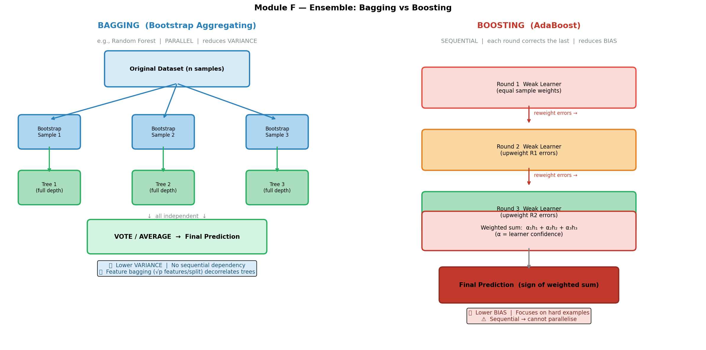
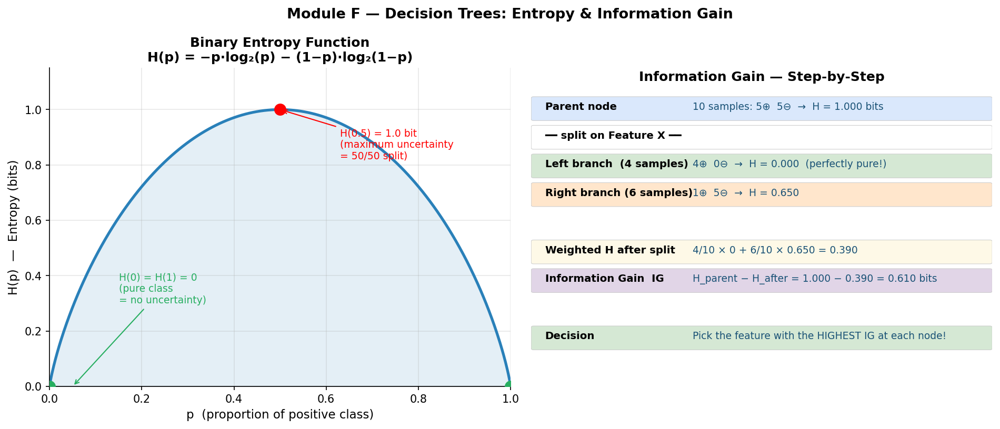

# Decision Trees & Ensemble Methods (Week 4 Lecture 2)

## 🎯 Exam Importance
🔴 **必考** | Sample Test Q5 (3 marks), Actual S1 2025 Q4 (2 marks), S1 2026 Sample Q5 (3 marks)

Random Forest feature bagging is **directly tested** in Q5. CART's greedy nature is tested in Q4. Entropy, Information Gain, and the Bagging vs Boosting distinction are foundational concepts that appear across multiple question types. You must be able to calculate entropy, explain why feature bagging decorrelates trees, explain what "greedy" means for CART, and trace through an AdaBoost round with numbers.

---

## 📖 Core Concepts

| English Term | 中文 | One-line Definition |
|---|---|---|
| Decision Tree（决策树） | 决策树 | A tree-structured classifier: internal nodes test features, branches represent values, leaves assign class labels |
| Root Node（根节点） | 根节点 | The topmost node that represents the first split on the entire dataset |
| Internal / Decision Node（内部节点） | 内部节点 / 决策节点 | A non-leaf node that tests a feature and branches based on the result |
| Leaf Node（叶节点） | 叶节点 | A terminal node that assigns a class label (classification) or value (regression) |
| Classification Tree（分类树） | 分类树 | Discrete output; leaf assigns **majority class** of the samples reaching it |
| Regression Tree（回归树） | 回归树 | Continuous output; leaf assigns **mean value** of the samples reaching it |
| CART（分类回归树） | 分类回归树 | Classification And Regression Trees -- always performs **binary** splits, uses Gini impurity |
| ID3 | ID3 算法 | Iterative Dichotomiser 3 -- multiway splits, categorical features only, uses Information Gain |
| C4.5 | C4.5 算法 | Extension of ID3 -- handles continuous features, converts tree to rules, performs pruning |
| Entropy $H(X)$（熵） | 熵 | $H(X) = -\sum p(x) \log_2 p(x)$ -- measures impurity/uncertainty in a distribution |
| Joint Entropy $H(X,Y)$（联合熵） | 联合熵 | Uncertainty when considering two variables jointly |
| Specific Conditional Entropy $H(Y\|X=x)$ | 特定条件熵 | $H(Y\|X=x) = -\sum p(y\|x) \log_2 p(y\|x)$ -- uncertainty about $Y$ given a specific value of $X$ |
| Conditional Entropy $H(Y\|X)$（条件熵） | 条件熵 | $H(Y\|X) = \sum P(X=x)\,H(Y\|X=x)$ -- remaining uncertainty about $Y$ after knowing $X$ |
| Information Gain（信息增益） | 信息增益 | $IG(Y\|X) = H(Y) - H(Y\|X)$ -- how much knowing $X$ reduces uncertainty about $Y$ |
| Gini Impurity（基尼不纯度） | 基尼不纯度 | $\text{Gini}(t) = 1 - \sum p_i^2$ -- alternative splitting criterion used in CART |
| Pruning（剪枝） | 剪枝 | Removing subtrees/leaf nodes to reduce overfitting; evaluate effect of deleting leaf nodes |
| Ensemble Method（集成方法） | 集成学习 | Combining multiple weak learners into one strong learner |
| Bagging（自助聚合） | 袋装法 / 自助聚合 | Bootstrap Aggregating -- train models independently on bootstrap samples, aggregate by vote/average |
| Bootstrap Sample（自助样本） | 自助样本 | A sample of size $n$ drawn **with replacement** from a dataset of size $n$ |
| Random Forest（随机森林） | 随机森林 | Bagging + feature bagging: at each split, only $\sqrt{p}$ random features are considered |
| Feature Bagging（特征袋装） | 特征袋装 | Randomly selecting a subset of features at each split to decorrelate trees |
| Boosting（提升法） | 提升法 | Sequential training where each new model focuses on errors of previous ones |
| AdaBoost（自适应提升） | 自适应提升 | Adaptive Boosting -- re-weights misclassified samples each round, combines weighted weak learners |
| Gradient Boosting（梯度提升） | 梯度提升 | Each new tree fits the residual errors (negative gradients) of the current ensemble |
| XGBoost（极端梯度提升） | 极端梯度提升 | Optimised gradient boosting with regularisation in the objective |
| Weak Learner（弱学习器） | 弱学习器 | A classifier only slightly better than random chance (e.g., a decision stump) |
| Decision Stump（决策桩） | 决策桩 | A decision tree with exactly one split (depth 1) |
| Bias（偏差） | 偏差 | Systematic error from a model too simple to capture the true relationship |
| Variance（方差） | 方差 | Sensitivity to training data -- how much the model changes with different samples |
| NP-complete（NP 完全） | NP 完全问题 | Finding the optimal decision tree is computationally intractable; hence we use greedy heuristics |

---

## 🧠 Feynman Draft -- Learning From Scratch

### The 20 Questions Game

Imagine you are playing the game "20 Questions（20个问题游戏）." Someone thinks of an animal, and you ask yes/no questions to narrow down the answer: "Is it bigger than a cat?" → "Does it live in water?" → "Does it have stripes?" Each question splits the remaining possibilities into two groups, and after enough questions you arrive at the answer.

That is exactly how a **decision tree** works. Each internal node asks a question about one feature (e.g., "Is income > $50K?"). Each branch is the answer (yes/no). Each leaf is the final prediction (e.g., "will repay loan" or "will default").

### Trees are Surprisingly Powerful

A decision tree can express **any Boolean function**. Think about it: for any truth table, you can build a tree that tests each input variable along a path from root to leaf. The tree might be huge, but it can always represent the function.

A decision tree can also **approximate any continuous function** (given enough depth and data).

Even better: every path from root to leaf maps directly to an IF-THEN rule:

```
Path: [root] Outlook=Sunny → [node] Humidity=High → [leaf] Don't Play

Rule: IF Outlook = Sunny AND Humidity = High THEN Don't Play Tennis
```

So a decision tree is essentially a **set of rules** -- just organized as a tree for efficient evaluation.

### What Makes a Good Question?

Not all questions are equally useful. Asking "Is it alive?" when you already know it is an animal is worthless -- it does not split anything. The best question is one that reduces your **uncertainty** the most.

**Entropy** measures this uncertainty. Think of it as "how surprised are you, on average, by the outcome?"

- **Fair coin flip**: You have no idea what is coming -- maximum surprise. $H = 1$ bit.
- **Biased coin (90% heads)**: You mostly expect heads -- less surprise. $H \approx 0.47$ bits.
- **Certain outcome (100% heads)**: No surprise at all. $H = 0$ bits.

**Information Gain** tells you how much a particular question reduces entropy. You always pick the question with the highest Information Gain -- the one that tells you the most.

### But Finding the Best Tree is Impossible...

Here's the catch: finding the **optimal** decision tree (the smallest tree that correctly classifies all training data) is an **NP-complete problem**. That means there's no known algorithm that can solve it efficiently for large datasets.

So what do we do? We use a **greedy heuristic**: at each node, pick the best split **right now** without worrying about future splits. This is fast but not guaranteed to find the global optimum.

### Toy Entropy Calculation

Suppose you have 10 emails: 6 spam, 4 not-spam.

$$H(Y) = -\frac{6}{10}\log_2\frac{6}{10} - \frac{4}{10}\log_2\frac{4}{10}$$
$$= -0.6 \times (-0.737) - 0.4 \times (-1.322)$$
$$= 0.442 + 0.529 = 0.971 \text{ bits}$$

Now you split on the feature "contains FREE":
- "FREE" group: 5 emails (5 spam, 0 not-spam) → $H = 0$ (pure!)
- "no FREE" group: 5 emails (1 spam, 4 not-spam) → $H = -\frac{1}{5}\log_2\frac{1}{5} - \frac{4}{5}\log_2\frac{4}{5} = 0.722$ bits

Conditional entropy after split:

$$H(Y|X) = \frac{5}{10} \times 0 + \frac{5}{10} \times 0.722 = 0.361 \text{ bits}$$

Information Gain: $IG = 0.971 - 0.361 = 0.610$ bits. This is a great split!

### From One Tree to a Forest -- Wisdom of Crowds

A single decision tree is like asking one person for their opinion. That person might be knowledgeable but also biased -- they might latch onto irrelevant quirks of their own experience. This is **overfitting**: the tree memorises the training data (high variance).

Now imagine asking 2,048 different people, each of whom:
1. Studied a slightly different version of the material (different **bootstrap samples** of data)
2. Focused on different aspects (different **random subsets of features**)

Then you take a majority vote. Individual errors cancel out. This is **Random Forest（随机森林）** -- the "wisdom of crowds" for machine learning.

### Why Feature Bagging is Essential (Not Just Data Bagging!)

Here's a subtle but critical point. Even with bagging (training on different bootstrap samples), if one feature is overwhelmingly strong (say, "blood sugar level" for predicting diabetes), **every tree will put that feature at the root**. The trees become nearly identical despite seeing different data subsets. Averaging 2,048 identical trees is no better than having one tree.

**Feature bagging** solves this: at each split, only $\sqrt{p}$ randomly chosen features are considered. Most trees won't even have the dominant feature available at their root. This forces diversity -- trees explore different parts of the feature space and make different kinds of errors, which average out beautifully.

### Bagging vs Boosting -- Two Strategies for Teamwork



**Bagging（袋装法）** = "parallel teamwork." Everyone works independently on their own slightly different version of the problem. Then you average. Good when each individual is smart but unreliable (high variance).

**Boosting（提升法）** = "sequential coaching." The first person tries, the second person specifically studies the first person's mistakes, the third person studies mistakes that remain, and so on. Good when each individual is weak/simple (high bias).

⚠️ **Common Misconception 1**: Many students confuse **feature bagging** with **data bagging (bootstrapping)**. They are two separate things that happen together in Random Forest:
- **Data bagging** = each tree trains on a different bootstrap sample of the data (sample with replacement)
- **Feature bagging** = at each split, each tree only considers $\sqrt{p}$ randomly chosen features

Both are needed. Data bagging alone is just "Bagging." Adding feature bagging on top makes it "Random Forest."

⚠️ **Common Misconception 2**: Students think "greedy" means "fast" or "lazy." In decision trees, **greedy means the algorithm selects the best split at each node without looking ahead** to see how that split affects future nodes. It makes the locally optimal choice, which may not be globally optimal.

⚠️ **Common Misconception 3**: "Bagging reduces bias" -- NO! Bagging reduces **variance**. Boosting reduces **bias**.

💡 **Core Intuition**: Many diverse, slightly-wrong trees vote together to produce one highly accurate prediction -- strength through diversity.

---

## 📐 Formal Definitions

### Entropy（熵）



Entropy measures the average uncertainty (impurity) in a probability distribution:

$$H(X) = -\sum_{x \in \mathcal{X}} p(x) \log_2 p(x)$$

Key properties:
- $H(X) \geq 0$ always
- $H(X) = 0$ iff one outcome has probability 1 (complete certainty)
- For binary classification: $H_{\max} = 1$ bit (when $p = 0.5$)
- More classes → higher potential entropy: $H_{\max} = \log_2 k$ for $k$ classes
- **Maximum when uniform**: for binary case, $p = 0.5$ gives $H = 1$ bit

**Canonical examples:**
- Fair coin: $H = -0.5\log_2(0.5) - 0.5\log_2(0.5) = 0.5 + 0.5 = 1$ bit
- Biased coin ($p=0.9$): $H = -0.9\log_2(0.9) - 0.1\log_2(0.1) = 0.137 + 0.332 = 0.469$ bits

### Joint Entropy（联合熵）

The uncertainty when considering two random variables together:

$$H(X, Y) = -\sum_{x \in \mathcal{X}} \sum_{y \in \mathcal{Y}} p(x, y) \log_2 p(x, y)$$

### Specific Conditional Entropy（特定条件熵）

The entropy of $Y$ given a **specific** value of $X$:

$$H(Y | X = x) = -\sum_{y \in \mathcal{Y}} p(y | x) \log_2 p(y | x)$$

This measures: "How uncertain am I about $Y$ when I know $X$ takes value $x$?"

### Conditional Entropy（条件熵）

The **expected** remaining uncertainty about $Y$ after observing $X$:

$$H(Y | X) = \sum_{x \in \mathcal{X}} P(X = x)\, H(Y | X = x)$$

This is a **weighted average** of the specific conditional entropies, weighted by the probability of each value of $X$.

Expanded form:

$$H(Y | X) = -\sum_{x \in \mathcal{X}} \sum_{y \in \mathcal{Y}} p(x, y) \log_2 p(y | x)$$

### Entropy Properties (Exam-Critical)

1. **Non-negativity**: $H(X) \geq 0$
2. **Chain Rule**: $H(X, Y) = H(X | Y) + H(Y) = H(Y | X) + H(X)$
3. **Independence**: If $X$ and $Y$ are independent, $H(Y | X) = H(Y)$ (knowing $X$ tells you nothing about $Y$)
4. **Conditioning reduces entropy**: $H(Y | X) \leq H(Y)$ (knowing something never increases uncertainty)

### Information Gain（信息增益）

$$IG(Y | X) = H(Y) - H(Y | X)$$

- If $X$ tells us nothing about $Y$: $IG = 0$
- If $X$ perfectly determines $Y$: $IG = H(Y)$ (all uncertainty removed)
- Always non-negative: $IG \geq 0$ (knowing something never increases uncertainty)

**Decision tree splitting rule**: At each node, choose the feature $X^*$ that maximises $IG(Y | X^*)$.

### Gini Impurity（基尼不纯度）-- Used in CART

$$\text{Gini}(t) = 1 - \sum_{i=1}^{k} p_i^2$$

Where $p_i$ is the proportion of class $i$ at node $t$.

**Interpretation**: Probability that two randomly drawn samples from the node belong to different classes.

**Weighted Gini after a binary split:**

$$\text{Gini}_{\text{split}}(D, A) = \frac{n_1}{n}\,\text{Gini}(D_1) + \frac{n_2}{n}\,\text{Gini}(D_2)$$

**Gini Reduction** = $\text{Gini}(\text{parent}) - \text{Gini}_{\text{split}}$

CART chooses the split that **maximises Gini Reduction** (equivalently, **minimises weighted Gini after split**).

**Comparison**: Entropy and Gini give very similar splits in practice. Gini is slightly faster to compute (no logarithm). ID3/C4.5 use entropy; CART uses Gini.

### ID3 vs C4.5 vs CART (Classical Algorithms)

| Feature | ID3 | C4.5 | CART |
|---|---|---|---|
| **Split type** | Multiway (one branch per value) | Multiway | **Binary only** |
| **Feature types** | Categorical only | Categorical + Continuous | Categorical + Continuous |
| **Splitting criterion** | Information Gain | Gain Ratio (normalised IG) | **Gini Impurity** (classification) / MSE (regression) |
| **Pruning** | No | Yes (converts tree to rules, prunes) | Yes (evaluates effect of deleting leaves) |
| **Missing values** | No handling | Handles missing values | Handles missing values |
| **Output** | Classification only | Classification (can convert to rules) | Classification AND Regression |

### CART is GREEDY (Exam-Critical!)

**CART selects the best split at each node WITHOUT looking ahead.** It makes no effort to craft an optimal tree overall -- it just makes the maximally good local decision at each step.

Why does this matter?
- The problem of finding the globally optimal tree is **NP-complete**
- Greedy does NOT guarantee the global optimum
- A suboptimal early split might lead to a much worse tree overall
- But greedy is fast and works well enough in practice

This is directly tested: **S1 2025 Actual Q4 (2 marks)** asks what "greedy" means for CART.

### Decision Tree Problems

1. **Overfitting**: Deep trees memorise training noise
2. **Exponentially less data at lower levels**: Each split halves (roughly) the data; by level 10, leaves may have very few samples
3. **Greedy ≠ global optimum**: As explained above
4. **Solution**: Pruning -- evaluate the effect of deleting leaf nodes, yields simpler trees, reduces overfitting

### Expressiveness of Decision Trees

- Can express **any Boolean function** (build a tree for any truth table)
- Can **approximate any continuous function** (with sufficient depth)
- Every path from root to leaf = one IF-THEN rule
- A decision tree is equivalent to a **disjunction of conjunctions** (OR of ANDs)

```
Tree:
        [Outlook]
       /    |    \
   Sunny Overcast  Rain
     |      |       |
  [Humid] Play   [Wind]
   / \            / \
 No  Yes       No  Yes

Rules:
  IF Outlook=Overcast THEN Play
  IF Outlook=Sunny AND Humidity=Normal THEN Play
  IF Outlook=Rain AND Wind=Weak THEN Play
  (otherwise: Don't Play)
```

### AdaBoost Algorithm（自适应提升算法）

**Initialise:** $w_i = \frac{1}{N}$ for all $N$ training samples.

**For each round $t = 1, 2, \ldots, T$:**

1. **Train** weak learner $h_t$ using sample weights $\{w_i\}$
2. **Compute weighted error:**
   $$\varepsilon_t = \frac{\sum_{i=1}^{N} w_i \cdot \mathbb{1}[h_t(x_i) \neq y_i]}{\sum_{i=1}^{N} w_i}$$
3. **Compute classifier weight:**
   $$\alpha_t = \frac{1}{2} \ln\left(\frac{1 - \varepsilon_t}{\varepsilon_t}\right)$$
4. **Update sample weights:**
   $$w_i \leftarrow w_i \cdot \exp\left(2\alpha_t \cdot \mathbb{1}[h_t(x_i) \neq y_i]\right)$$
   (Misclassified samples get heavier; correctly classified stay the same or get lighter)

**Final prediction:**
$$H(x) = \text{sign}\left(\sum_{t=1}^{T} \alpha_t\, h_t(x)\right)$$

### Gradient Boosting / XGBoost Objective

Each new tree $f_t$ fits the **residual errors** (pseudo-residuals = negative gradients of the loss):

$$\hat{y}_i^{(t)} = \hat{y}_i^{(t-1)} + f_t(x_i)$$

**Objective function (with regularisation):**

$$\mathcal{L} = \sum_{i=1}^{N} \ell(y_i, \hat{y}_i) + \sum_{t=1}^{T} \Omega(f_t)$$

Where $\Omega(f_t) = \gamma T_{\text{leaves}} + \frac{1}{2}\lambda \|w\|^2$ penalises tree complexity.

**Key difference from AdaBoost**: AdaBoost adds one weak rule (typically a stump) per round; Gradient Boosting adds one full tree per round that fits the gradient of the loss function.

---

## 🔄 How It Works -- Step by Step

### 1. Building a Decision Tree (Greedy, Top-Down)

**Algorithm:**

```
function BuildTree(data D, features F):
    if all samples in D have the same label:
        return LeafNode(that label)
    if F is empty or stopping criterion met:
        return LeafNode(majority label in D)
    
    best_feature = argmax_{X in F} IG(Y | X)   // or min Gini
    node = InternalNode(best_feature)
    
    for each value v of best_feature:
        D_v = subset of D where best_feature = v
        node.addChild(v, BuildTree(D_v, F \ {best_feature}))
    
    return node
```

**Important**: This is a **greedy** algorithm. It picks the locally best split at each step. It does NOT look ahead to see how the current split affects future splits. It does NOT guarantee the globally optimal tree -- the problem of finding the optimal tree is **NP-hard**.

### 2. Entropy Calculation -- Worked Example

**Lecture example: Coin flip entropy**

Fair coin ($p = 0.5$):
$$H = -0.5 \log_2(0.5) - 0.5 \log_2(0.5) = -0.5 \times (-1) - 0.5 \times (-1) = 0.5 + 0.5 = 1 \text{ bit}$$

Biased coin ($p = 0.9$):
$$H = -0.9 \log_2(0.9) - 0.1 \log_2(0.1)$$
$$= -0.9 \times (-0.152) - 0.1 \times (-3.322)$$
$$= 0.137 + 0.332 = 0.469 \text{ bits}$$

Notice: the more "certain" the outcome, the lower the entropy. A fair coin (maximum uncertainty) has maximum entropy of 1 bit.

### 3. Information Gain -- Worked Example

Dataset: 14 samples for "Play Tennis?" -- 9 Yes, 5 No.

$$H(Y) = -\frac{9}{14}\log_2\frac{9}{14} - \frac{5}{14}\log_2\frac{5}{14} = 0.940 \text{ bits}$$

Split on feature "Outlook" with values {Sunny, Overcast, Rain}:

| Outlook | Yes | No | Total | $H$ |
|---|---|---|---|---|
| Sunny | 2 | 3 | 5 | $-\frac{2}{5}\log_2\frac{2}{5} - \frac{3}{5}\log_2\frac{3}{5} = 0.971$ |
| Overcast | 4 | 0 | 4 | $0$ (pure) |
| Rain | 3 | 2 | 5 | $-\frac{3}{5}\log_2\frac{3}{5} - \frac{2}{5}\log_2\frac{2}{5} = 0.971$ |

$$H(Y|\text{Outlook}) = \frac{5}{14}(0.971) + \frac{4}{14}(0) + \frac{5}{14}(0.971) = 0.694 \text{ bits}$$

$$IG(Y|\text{Outlook}) = 0.940 - 0.694 = 0.246 \text{ bits}$$

Compare with other features. If "Outlook" gives the highest $IG$, it becomes the root split.

### 4. Gini Impurity -- Worked Example

Same dataset: 9 Yes, 5 No out of 14.

$$\text{Gini}(\text{parent}) = 1 - \left(\frac{9}{14}\right)^2 - \left(\frac{5}{14}\right)^2 = 1 - 0.413 - 0.128 = 0.459$$

Split on "Outlook=Sunny" (binary: Sunny vs Not-Sunny):
- Sunny: 5 samples (2 Yes, 3 No) → $\text{Gini} = 1 - (2/5)^2 - (3/5)^2 = 1 - 0.16 - 0.36 = 0.48$
- Not-Sunny: 9 samples (7 Yes, 2 No) → $\text{Gini} = 1 - (7/9)^2 - (2/9)^2 = 1 - 0.605 - 0.049 = 0.346$

$$\text{Gini}_{\text{split}} = \frac{5}{14}(0.48) + \frac{9}{14}(0.346) = 0.171 + 0.222 = 0.393$$

$$\text{Gini Reduction} = 0.459 - 0.393 = 0.066$$

### 5. AdaBoost -- 3-Round Worked Example (from Lecture)

**Setup**: 10 samples, equal initial weights $w_i = 0.1$.

**Round 1:**
- Train stump $h_1$ → misclassifies 3 samples
- $\varepsilon_1 = 3 \times 0.1 = 0.3$
- $\alpha_1 = \frac{1}{2}\ln\frac{1 - 0.3}{0.3} = \frac{1}{2}\ln\frac{0.7}{0.3} = \frac{1}{2}\ln(2.333) = \frac{1}{2}(0.847) = 0.424$
- Update: misclassified samples get weight multiplied by $e^{2 \times 0.424} = e^{0.847} \approx 2.333$
- New weights: 7 correct samples keep $w = 0.1$; 3 misclassified get $w = 0.1 \times 2.333 = 0.233$
- (After normalisation, misclassified samples now dominate)

**Round 2:**
- Train stump $h_2$ (focuses more on previously misclassified samples)
- $\varepsilon_2 = 0.21$
- $\alpha_2 = \frac{1}{2}\ln\frac{0.79}{0.21} = \frac{1}{2}\ln(3.762) = \frac{1}{2}(1.326) = 0.653$
- Higher $\alpha$ → this learner is more confident and gets more vote weight

**Round 3:**
- $\varepsilon_3 = 0.14$
- $\alpha_3 = \frac{1}{2}\ln\frac{0.86}{0.14} = \frac{1}{2}\ln(6.143) = \frac{1}{2}(1.815) = 0.916$
- Even higher $\alpha$ → even more confident

**Final classifier:**
$$H(x) = \text{sign}(0.424 \cdot h_1(x) + 0.653 \cdot h_2(x) + 0.916 \cdot h_3(x))$$

**Pattern to notice:** As rounds progress, $\varepsilon_t$ decreases (learners get better at the remaining hard cases) and $\alpha_t$ increases (better learners get more vote weight).

### 6. Random Forest Construction

```
function RandomForest(data D, num_trees M, num_features_per_split k):
    forest = []
    for i = 1 to M:
        D_i = BootstrapSample(D)          // sample n points WITH replacement
        T_i = BuildTree(D_i, k)            // at each split, randomly pick k features
        forest.append(T_i)
    return forest

function Predict(forest, x):
    votes = [T_i.predict(x) for T_i in forest]
    return MajorityVote(votes)             // classification
    // or return Average(votes)            // regression
```

**Typical hyperparameters (from lecture):**
- Number of trees: 2,048 (or similar large number)
- Features per split: $k = \sqrt{p}$ where $p$ = total features
  - Example: 225 features → $\sqrt{225} = 15$ features considered at each split

---

## ⚖️ Trade-offs & Comparisons

### Single Tree vs Random Forest vs Gradient Boosting

| Aspect | Single Decision Tree | Random Forest | AdaBoost / XGBoost |
|---|---|---|---|
| **Training** | Greedy, very fast | Parallel (embarrassingly so) | Sequential (cannot parallelise rounds) |
| **Variance** | High (overfits easily) | **Low** (averaging decorrelates) | Low |
| **Bias** | Low (can fit complex boundaries) | Low (same as base tree) | **Very low** (iteratively corrects errors) |
| **Interpretability** | **High** (can visualise) | Low (thousands of trees) | Low |
| **Sensitivity to noise** | High | Moderate (robust via averaging) | **High** (boosting amplifies noisy samples) |
| **Risk of overfitting** | High | Low | Moderate (can overfit with too many rounds) |
| **Typical use** | Simple, explainable models | General-purpose, robust | Kaggle competitions, max accuracy |

### Bagging vs Boosting

| Feature | Bagging | Boosting |
|---|---|---|
| **Training order** | Independent / parallel | Sequential |
| **Sample weighting** | Equal (uniform bootstrap) | Adaptive (misclassified samples upweighted) |
| **Primary effect** | **Reduces variance** | **Reduces bias** |
| **Base learner** | Full decision tree | Usually weak learner (stump) |
| **Combination rule** | Majority vote / average | Weighted vote ($\alpha_t$) |
| **Example algorithms** | Random Forest | AdaBoost, GBM, XGBoost |
| **Risk** | Cannot fix inherent bias of base learner | Can overfit to noise if too many rounds |

### Entropy vs Gini Impurity

| Property | Entropy ($H$) | Gini Impurity |
|---|---|---|
| **Formula** | $-\sum p_i \log_2 p_i$ | $1 - \sum p_i^2$ |
| **Range (binary)** | $[0, 1]$ | $[0, 0.5]$ |
| **Maximum** | At $p = 0.5$ (= 1 bit) | At $p = 0.5$ (= 0.5) |
| **Computation** | Requires logarithm | Only multiplication |
| **Used by** | ID3, C4.5 | CART |
| **In practice** | Very similar splits | Very similar splits |

### The Key Takeaway (exam-critical)

| Strategy | What it does | What it reduces |
|---|---|---|
| **Bagging** | Averages many independent models → stabilises predictions | **Variance** |
| **Boosting** | Sequentially corrects errors → improves accuracy | **Bias** |

---

## 🏗️ Design Question Framework

### If asked: "What does greedy mean for CART?" (S1 2025 Actual Q4, 2 marks)

**Answer**: "CART is greedy because it **selects the best split at each node without looking ahead** to see how the split affects future decisions. It makes **no effort to craft an optimal tree overall** -- it just makes the maximally good **local** decision at each step. Since finding the globally optimal decision tree is NP-complete, this greedy approach is a practical necessity. The trade-off is that a locally optimal split at one node might lead to a suboptimal tree structure overall."

### If asked: "Explain how Random Forest works and why feature bagging helps." (S1 2025 Sample Q5 / S1 2026 Sample Q5, 3 marks)

**WHAT**: "Random Forest is an ensemble method that combines Bagging with Feature Bagging. It creates many decision trees, each trained on a different bootstrap sample of the data. At each split within each tree, only a random subset of $\sqrt{p}$ features is considered."

**WHY**: "A single decision tree is prone to overfitting (high variance). By training many trees on different data subsets and averaging their predictions, we reduce variance. Feature bagging further decorrelates the trees -- without it, every tree would select the same dominant feature at the root, making all trees nearly identical and defeating the purpose of ensemble averaging."

**HOW**: "1) Sample $n$ points with replacement from the training data to create a bootstrap sample. 2) Build a decision tree on this sample, but at each node only evaluate $\sqrt{p}$ randomly chosen features and pick the best among those. 3) Repeat for $M$ trees (e.g., 2,048). 4) For a new input, collect predictions from all trees and take the majority vote."

**TRADE-OFF**: "Each individual tree in a Random Forest is slightly less accurate than a single optimised tree (because it does not see all features at every split). However, the diversity gained makes the ensemble as a whole far more accurate and robust. The trade-off is interpretability -- a single tree can be visualised and understood, but a forest of 2,048 trees cannot."

**EXAMPLE**: "With 225 features, each tree considers $\sqrt{225} = 15$ features at each split. This ensures that even if one feature is very strong, most trees will not have it available at the root -- producing diverse trees."

### If asked: "Compare Bagging and Boosting."

1. **Define both** with one sentence each
2. **State the key difference**: parallel vs sequential, variance reduction vs bias reduction
3. **Give a concrete algorithm** for each: Random Forest (bagging) and AdaBoost (boosting)
4. **Discuss when to use which**: bagging when individual models overfit; boosting when individual models underfit
5. **Mention the risk**: boosting can overfit to noise if run for too many rounds

### If asked: "Compute Information Gain for a given split."

1. **Compute $H(Y)$** for the parent node
2. **Compute $H(Y|X=v)$** for each child node (specific conditional entropy)
3. **Compute $H(Y|X)$** as the weighted average (conditional entropy)
4. **Compute $IG = H(Y) - H(Y|X)$**
5. **Interpret**: "This split reduces uncertainty by ... bits, which is [good/poor]"

---

## 📝 历年真题与考试练习（Exam Questions & Practice）

### S1 2025 Sample Q5 / S1 2026 Sample Q5 (3 marks) -- Feature Bagging in Random Forest

**Question**: A Random Forest is built on a dataset with 225 features.

(a) [2 marks] How does bagging select features in Random Forest?

(b) [1 mark] Why is feature bagging beneficial?

<details>
<summary><strong>Click to reveal model answer</strong></summary>

**(a)** In Random Forest, at each split in each tree, instead of evaluating all 225 features, only a **random subset** of features is considered. The typical subset size is $\sqrt{p} = \sqrt{225} = 15$ features per split. Each tree is also trained on a **bootstrap sample** -- $n$ data points sampled **with replacement** from the original $n$ data points. A large number of trees are constructed (e.g., 2,048), each using different random feature subsets at every node. The final prediction is made by **majority vote** (classification) or **averaging** (regression) across all trees.

**(b)** Feature bagging is beneficial because it **decorrelates the trees** in the ensemble. Without feature bagging, if one feature is much stronger than the others, every tree would select it at the root node, making all trees highly similar. Averaging correlated predictions provides little variance reduction. By forcing each tree to consider different features, the trees become **structurally diverse**, and their averaged prediction is much more robust and accurate.

</details>

---

### S1 2025 Actual Q4 (2 marks) -- Greedy Nature of CART

**Question**: What does "greedy" mean in the context of CART decision trees?

<details>
<summary><strong>Click to reveal model answer</strong></summary>

CART is **greedy** because it **selects the best split at each node without looking ahead** to future nodes. At each decision point, it evaluates all possible features and thresholds, and picks the one that maximises the Gini reduction (or minimises Gini impurity) **locally** at that node.

It makes **no effort to craft an optimal tree overall** -- it simply makes the **maximally good local decision** at each step. This means:
- A split that looks best now might not be globally optimal
- A different first split might have led to a much better tree structure
- But finding the globally optimal tree is **NP-complete**, so this greedy heuristic is a practical trade-off between quality and computational feasibility

**Key phrase**: "CART selects the best split at each node without looking ahead, making just the maximal local decision rather than optimising the overall tree structure."

</details>

---

### Practice Problem 1: Entropy Calculation (2 marks)

**Q**: A dataset has 100 samples: 70 positive, 30 negative. Calculate the entropy $H(Y)$.

<details>
<summary>Click to reveal answer</summary>

$$H(Y) = -\frac{70}{100}\log_2\frac{70}{100} - \frac{30}{100}\log_2\frac{30}{100}$$
$$= -0.7 \log_2(0.7) - 0.3 \log_2(0.3)$$
$$= -0.7 \times (-0.515) - 0.3 \times (-1.737)$$
$$= 0.360 + 0.521 = 0.881 \text{ bits}$$

This is less than 1 bit (maximum for binary), reflecting the imbalance toward positive class.

</details>

### Practice Problem 2: Information Gain (3 marks)

**Q**: Given 8 samples for "Buy Computer?" -- 5 Yes, 3 No. Splitting on "Student?" gives:
- Student=Yes: 4 samples (3 Yes, 1 No)
- Student=No: 4 samples (2 Yes, 2 No)

Calculate the Information Gain of splitting on "Student?"

<details>
<summary>Click to reveal answer</summary>

**Step 1**: Parent entropy:
$$H(Y) = -\frac{5}{8}\log_2\frac{5}{8} - \frac{3}{8}\log_2\frac{3}{8} = -0.625(-0.678) - 0.375(-1.415) = 0.424 + 0.530 = 0.954 \text{ bits}$$

**Step 2**: Child entropies (specific conditional entropies):
$$H(Y|\text{Student}=\text{Yes}) = -\frac{3}{4}\log_2\frac{3}{4} - \frac{1}{4}\log_2\frac{1}{4} = 0.311 + 0.500 = 0.811 \text{ bits}$$
$$H(Y|\text{Student}=\text{No}) = -\frac{2}{4}\log_2\frac{2}{4} - \frac{2}{4}\log_2\frac{2}{4} = 0.5 + 0.5 = 1.0 \text{ bit}$$

**Step 3**: Conditional entropy (weighted average):
$$H(Y|\text{Student}) = \frac{4}{8}(0.811) + \frac{4}{8}(1.0) = 0.406 + 0.500 = 0.906 \text{ bits}$$

**Step 4**: Information Gain:
$$IG = 0.954 - 0.906 = 0.048 \text{ bits}$$

This is a very small gain -- "Student?" is a weak splitting feature here.

</details>

### Practice Problem 3: Gini Impurity Calculation (3 marks)

**Q**: A node contains 20 samples: 12 Class A, 8 Class B.

(a) Calculate the Gini impurity of this node.

(b) A binary split produces: Left child (8A, 2B), Right child (4A, 6B). Calculate the weighted Gini after the split and the Gini reduction.

<details>
<summary>Click to reveal answer</summary>

**(a)** Parent Gini:
$$\text{Gini} = 1 - \left(\frac{12}{20}\right)^2 - \left(\frac{8}{20}\right)^2 = 1 - 0.36 - 0.16 = 0.48$$

**(b)** Child Ginis:
$$\text{Gini}(\text{Left}) = 1 - \left(\frac{8}{10}\right)^2 - \left(\frac{2}{10}\right)^2 = 1 - 0.64 - 0.04 = 0.32$$
$$\text{Gini}(\text{Right}) = 1 - \left(\frac{4}{10}\right)^2 - \left(\frac{6}{10}\right)^2 = 1 - 0.16 - 0.36 = 0.48$$

Weighted Gini:
$$\text{Gini}_{\text{split}} = \frac{10}{20}(0.32) + \frac{10}{20}(0.48) = 0.16 + 0.24 = 0.40$$

Gini Reduction:
$$\Delta\text{Gini} = 0.48 - 0.40 = 0.08$$

</details>

### Practice Problem 4: AdaBoost Weight Calculation (2 marks)

**Q**: In round 1 of AdaBoost with 10 equally-weighted samples, the weak learner misclassifies 3 samples. Calculate $\alpha_1$ and describe what happens to the misclassified samples' weights.

<details>
<summary>Click to reveal answer</summary>

Weighted error: $\varepsilon_1 = 3 \times 0.1 = 0.3$

Classifier weight:
$$\alpha_1 = \frac{1}{2}\ln\frac{1 - 0.3}{0.3} = \frac{1}{2}\ln(2.333) = \frac{1}{2}(0.847) = 0.424$$

Weight update for misclassified samples:
$$w_i^{\text{new}} = 0.1 \times e^{2 \times 0.424} = 0.1 \times e^{0.847} = 0.1 \times 2.333 = 0.233$$

The 3 misclassified samples now have weight 0.233 each (vs 0.1 for correct ones). After normalisation, the next weak learner will "pay more attention" to these harder samples.

</details>

### Practice Problem 5: Bagging vs Boosting Conceptual (2 marks)

**Q**: Explain the key difference between Bagging and Boosting in terms of what type of error each method primarily reduces.

<details>
<summary>Click to reveal answer</summary>

**Bagging** (e.g., Random Forest) primarily reduces **variance**. It trains multiple models independently on bootstrap samples and averages their predictions. Averaging independent (or decorrelated) estimates reduces the fluctuations caused by different training sets.

**Boosting** (e.g., AdaBoost, XGBoost) primarily reduces **bias**. It trains models sequentially, with each new model focusing on the errors of the previous ensemble. This iterative error correction allows the ensemble to learn complex patterns that a single weak learner would miss.

**Summary**: Bagging stabilises (reduces variance); Boosting sharpens (reduces bias).

</details>

### Practice Problem 6: Chain Rule of Entropy (2 marks)

**Q**: State the chain rule of entropy and explain what it means intuitively.

<details>
<summary>Click to reveal answer</summary>

**Chain Rule:**
$$H(X, Y) = H(X | Y) + H(Y) = H(Y | X) + H(X)$$

**Intuition**: The total uncertainty of knowing both $X$ and $Y$ together equals the uncertainty of knowing $Y$ alone, plus the remaining uncertainty about $X$ after you already know $Y$ (or vice versa). In other words, you can decompose joint uncertainty into "what you know" plus "what remains."

**Special case**: If $X$ and $Y$ are independent:
$$H(X, Y) = H(X) + H(Y)$$
because $H(X|Y) = H(X)$ (knowing $Y$ tells you nothing about $X$).

</details>

### Practice Problem 7: Decision Tree to Rules (2 marks)

**Q**: Given the following decision tree, write out the equivalent IF-THEN rules.

```
        [Age > 30?]
        /         \
      Yes          No
      /              \
 [Income>50K?]     Reject
    /       \
  Yes       No
   |         |
 Approve   Reject
```

<details>
<summary>Click to reveal answer</summary>

```
Rule 1: IF Age > 30 AND Income > 50K THEN Approve
Rule 2: IF Age > 30 AND Income ≤ 50K THEN Reject
Rule 3: IF Age ≤ 30 THEN Reject
```

Each path from root to leaf corresponds to one rule. The tree is equivalent to a **disjunction of conjunctions**: Approve IF (Age>30 AND Income>50K).

</details>

---

## 🌐 English Expression Tips

### Describing Decision Trees
```
"A decision tree is a non-parametric supervised learning method where each
 internal node tests a feature, each branch represents a feature value, and
 each leaf node assigns a class label (classification) or a continuous value
 (regression)."

"At each node, the algorithm greedily selects the feature that maximises
 information gain, defined as IG(Y|X) = H(Y) - H(Y|X)."

"CART performs binary splits only and uses Gini impurity as its splitting
 criterion: Gini(t) = 1 - Σ pᵢ²."

"The greedy approach selects the best split at each node without looking
 ahead, making no effort to optimise the overall tree structure."
```

### Describing Entropy and Information Gain
```
"Entropy measures the average uncertainty in a distribution. High entropy
 means high impurity; low entropy means the distribution is concentrated."

"Information gain quantifies how much a given feature reduces our
 uncertainty about the target variable."

"The feature with the highest information gain is chosen as the splitting
 criterion at each node."

"Conditional entropy H(Y|X) is the weighted average of H(Y|X=x) over
 all values of X, representing the remaining uncertainty about Y after
 observing X."
```

### Describing Feature Bagging
```
"For each tree in the forest, at each split point, a random subset of
 features — typically of size √p — is sampled, and only these features
 are evaluated as potential splits."

"Feature bagging reduces the correlation between trees, which is essential
 because averaging highly correlated predictions provides little benefit
 in terms of variance reduction."

"The key insight is that without feature bagging, a single dominant feature
 would appear at the root of every tree, making the ensemble redundant."
```

### Describing "Greedy" (for CART Q4)
```
"CART is greedy in the sense that it selects the best split at each node
 without looking ahead to see how the split affects future nodes."

"It makes the maximally good local decision at each step, with no effort
 to craft an optimal tree overall."

"This is a practical necessity because finding the globally optimal decision
 tree is an NP-complete problem."
```

### Comparing Bagging and Boosting
```
"Bagging trains classifiers independently on bootstrap samples and
 aggregates their predictions by majority vote, primarily reducing variance."

"Boosting trains classifiers sequentially, with each new learner assigning
 higher weight to previously misclassified examples, primarily reducing bias."

"The fundamental distinction is: bagging operates in parallel and targets
 variance, while boosting operates sequentially and targets bias."
```

### Common Errors to Avoid

- ❌ "Bagging reduces bias" → ✅ "Bagging reduces **variance**"
- ❌ "Boosting reduces variance" → ✅ "Boosting reduces **bias**"
- ❌ "Feature bagging means training on different data" → ✅ "Feature bagging means considering different **features** at each split; data sampling (bootstrapping) is separate"
- ❌ "Random Forest = Bagging" → ✅ "Random Forest = Bagging **+ Feature Bagging**"
- ❌ "Information Gain can be negative" → ✅ "Information Gain is always $\geq 0$"
- ❌ "Gradient Boosting uses decision stumps" → ✅ "AdaBoost typically uses stumps; Gradient Boosting uses full trees that fit residuals"
- ❌ "Greedy means fast" → ✅ "Greedy means selecting the locally best option without looking ahead"
- ❌ "CART can do multiway splits" → ✅ "CART always performs **binary** splits; ID3 does multiway splits"

---

## ✅ Self-Test Checklist

- [ ] Can you define entropy, conditional entropy, joint entropy, and information gain with formulas?
- [ ] Can you state the chain rule: $H(X,Y) = H(X|Y) + H(Y)$?
- [ ] Can you distinguish specific conditional entropy $H(Y|X=x)$ from conditional entropy $H(Y|X)$?
- [ ] Can you compute $H(Y)$ for a binary distribution by hand?
- [ ] Can you compute $IG$ for a given feature split?
- [ ] Can you explain the greedy tree-building algorithm?
- [ ] Can you explain what "greedy" means for CART (no look-ahead, local optimum only)?
- [ ] Do you know why finding the optimal tree is NP-complete?
- [ ] Do you know why a single decision tree overfits (high variance, greedy, exponentially less data at lower levels)?
- [ ] Can you explain pruning and why it helps?
- [ ] Can you state the differences between ID3, C4.5, and CART?
- [ ] Can you explain the expressiveness of decision trees (any Boolean function, maps to IF-THEN rules)?
- [ ] Can you explain the 3 steps of Bagging: bootstrap → train → aggregate?
- [ ] Do you know Random Forest = Bagging + Feature Bagging?
- [ ] Can you explain **why** feature bagging decorrelates trees (and why that matters)?
- [ ] Given 225 features, do you know $\sqrt{225} = 15$ features per split?
- [ ] Do you know: Bagging reduces **variance**, Boosting reduces **bias**?
- [ ] Can you trace through one round of AdaBoost: compute $\varepsilon_t$, $\alpha_t$, and weight update?
- [ ] Do you know the difference between AdaBoost (adds stumps) and Gradient Boosting (fits residuals with trees)?
- [ ] Can you write the AdaBoost final classifier: $H(x) = \text{sign}(\sum \alpha_t h_t(x))$?
- [ ] Can you draw a decision tree and convert it to IF-THEN rules?
- [ ] Can you compute Gini impurity and Gini reduction for a split?
