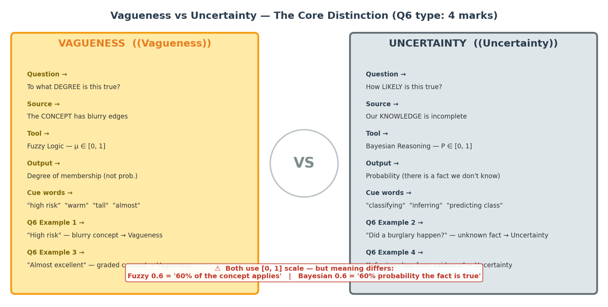
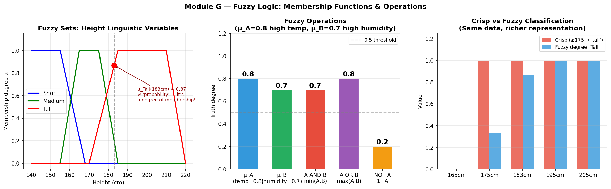
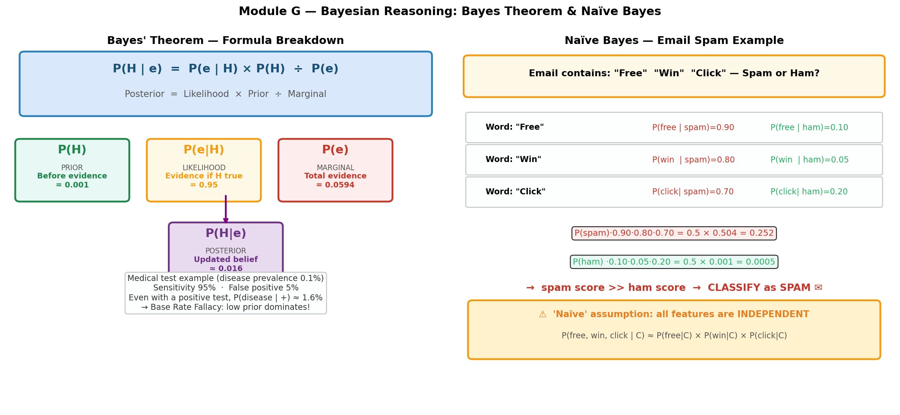

# Soft Computing — Fuzzy Logic, Bayesian Reasoning & Vagueness vs Uncertainty (W5L1)

## 🎯 考试重要度

🔴 **必考** | Sample Test Q6, **4 marks = 20% of total**

This topic directly maps to Q6 of the Sample Test (vagueness vs uncertainty classification). Additionally, Bayesian reasoning and fuzzy logic computations appear across multiple questions. Mastering the vagueness/uncertainty distinction alone is worth 4 easy marks if you know the pattern.

---

## 📖 核心概念（Core Concepts）

| English Term | 中文 | One-line Definition |
|---|---|---|
| Hard Computing（硬计算） | 硬计算 | Computation using crisp symbols, exact values, binary true/false — compilers, arithmetic, classical logic |
| Soft Computing（软计算） | 软计算 | Computation tolerating imprecision, partial truth, and degrees — fuzzy logic, Bayes, neural nets |
| Vagueness（模糊性） | 模糊性（语义模糊） | The **concept itself** has blurry boundaries — "tall", "warm", "high risk" have no sharp cutoff |
| Uncertainty（不确定性） | 不确定性 | The **state of the world** is unknown — a definite fact exists but we lack evidence to know it |
| Fuzzy Set（模糊集合） | 模糊集合 | A set where membership is a degree in [0, 1], not binary {0, 1} |
| Membership Function $\mu_A(x)$（隶属度函数） | 隶属度函数 | Maps an element $x$ to its degree of belonging to fuzzy set $A$, valued in $[0, 1]$ |
| Fuzzy Connectives（模糊逻辑联结词） | 模糊算子 | AND = min, OR = max, NOT = 1 - $\mu$ |
| Fuzzy Implication（模糊蕴含） | 模糊蕴含 | Standard: $A \rightarrow B = \max(1-A, B)$; Godel: $1$ if $A \leq B$, else $B$ |
| Bayes' Theorem（贝叶斯定理） | 贝叶斯定理 | $P(H \mid e) = P(e \mid H) \cdot P(H) / P(e)$ — updating belief with evidence |
| Prior $P(H)$（先验概率） | 先验概率 | Probability of hypothesis before observing evidence |
| Likelihood $P(e \mid H)$（似然） | 似然 | Probability of observing evidence given the hypothesis is true |
| Posterior $P(H \mid e)$（后验概率） | 后验概率 | Updated probability of hypothesis after observing evidence |
| Naive Bayes Classifier（朴素贝叶斯分类器） | 朴素贝叶斯 | Classifier assuming conditional independence: $P(C \mid \mathbf{x}) \propto P(C) \prod P(x_i \mid C)$ |

---

## 🧠 费曼草稿（Feynman Draft）

### The Weather Forecast Analogy

Imagine you check the weather app and it says **"70% chance of rain."** That is **uncertainty** — either it will rain or it won't (a definite fact about the future), but you don't know which. You assign a probability to reflect your incomplete knowledge.

Now imagine your friend says **"It's a warm day."** Is 22 degrees warm? What about 25 degrees? 18 degrees? There is no sharp cutoff. The concept of "warm" itself has blurry edges. That is **vagueness** — the word "warm" does not have a crisp boundary, so you assign a **degree of membership** instead.

This is the single most important distinction in this entire chapter:

| | Vagueness | Uncertainty |
|---|---|---|
| What is blurry? | The **concept** itself | Our **knowledge** of the world |
| Real-world example | "Is this person tall?" | "Did a burglary happen?" |
| The right question | "To what **degree** is this true?" | "How **likely** is this true?" |
| Tool | Fuzzy Logic | Bayesian Reasoning |
| Output | Membership degree $\mu \in [0,1]$ | Probability $P \in [0,1]$ |

### Building Intuition for Fuzzy Logic

Think of a dimmer switch for lights. A classical (hard computing) light switch is either ON or OFF — that's a classical set. A dimmer switch lets you set any brightness level from 0% to 100% — that's a fuzzy set.

When we say $\mu_{\text{Tall}}(183\text{cm}) = 0.6$, we mean: "183cm belongs to the set 'Tall' with degree 0.6." This is **NOT** saying "there's a 60% probability this person is tall." There's no randomness involved! The person is definitely 183cm. We're just saying the **concept of tallness** partially applies.

**Concrete number example:**

Let $\mu_{\text{high\_temp}} = 0.8$ and $\mu_{\text{high\_humidity}} = 0.7$. Then:

- Fuzzy AND (both high temp **and** high humidity): $\min(0.8, 0.7) = 0.7$
- Fuzzy OR (high temp **or** high humidity): $\max(0.8, 0.7) = 0.8$
- Fuzzy NOT high temp: $1 - 0.8 = 0.2$

Why min for AND? Because the weakest link determines the overall conjunction — you're only as "both tall and heavy" as the lesser of the two degrees.

### Building Intuition for Bayesian Reasoning

Think of a doctor updating their diagnosis. Before any tests, the doctor thinks: "This disease is rare, maybe 1 in 10,000 chance" — that's the **prior**. Then a test comes back positive. The test is 95% accurate. Now what?

Many students instinctively say "95% chance the patient has the disease!" But that's wrong. If 10,000 people are tested, about 1 truly has the disease (and tests positive), but about 500 healthy people also test positive (5% false positive rate of 9,999). So the actual chance is roughly $1/501 \approx 0.2\%$. The prior matters enormously!

This is exactly what Bayes' theorem captures: **posterior $\propto$ prior $\times$ likelihood**.

### What Does "Soft" Mean?

"Soft" does not mean weak or inferior. It means the system **tolerates imprecision** to solve problems that hard computing cannot handle. A washing machine fuzzy controller doesn't need to know the exact dirtiness level — an approximate "somewhat dirty" is enough to pick a good wash cycle. A spam filter doesn't need perfect certainty — a probability above 0.9 is enough to move the email to junk.

⚠️ **Common Misconception**: Many students confuse fuzzy membership with probability. When we say $\mu_{\text{Tall}}(183\text{cm}) = 0.6$, we are **not** saying "60% chance this person is tall." The person IS 183cm — there's no randomness. The 0.6 is a **degree of truth**, not a likelihood. Fuzzy logic handles **vagueness** (blurry concepts); probability handles **uncertainty** (unknown facts).

💡 **Core Intuition**: Fuzzy asks "to what degree?" about blurry concepts; Bayes asks "how likely?" about unknown facts.

---

## 📐 正式定义（Formal Definition）

### Hard Computing vs Soft Computing



| Feature | Hard Computing（硬计算） | Soft Computing（软计算） |
|---|---|---|
| Values | Crisp symbols, exact numbers | Approximate, degrees, partial truth |
| Truth model | Binary: True or False | Continuous: degrees in [0, 1], probabilities |
| Reasoning | Deductive, deterministic | Inductive, probabilistic, heuristic |
| Tolerance | No tolerance for imprecision | Tolerates and exploits imprecision |
| Examples | Classical logic, arithmetic, compilers, SQL | Fuzzy logic, Bayesian networks, neural networks |
| Strengths | Precision, provable correctness | Handling real-world ambiguity, noise, complexity |
| Limitations | Brittle with noisy/vague inputs | May sacrifice exactness for tractability |

**Key lecture point**: "Soft" does not mean weak — it means flexible enough to handle the messiness of the real world.

### Fuzzy Set Theory

**Classical (crisp) set:**

$$\mu_A(x) \in \{0, 1\}$$

An element either belongs to the set ($1$) or does not ($0$).

**Fuzzy set:**

$$\mu_A: X \rightarrow [0, 1]$$

An element belongs to the set with a **degree** between 0 and 1.

**Example**: Define a fuzzy set "Tall" for heights:

| Height (cm) | $\mu_{\text{Tall}}$ |
|---|---|
| 160 | 0.0 |
| 170 | 0.2 |
| 175 | 0.4 |
| 180 | 0.6 |
| 183 | 0.7 |
| 190 | 0.9 |
| 200 | 1.0 |

$\mu_{\text{Tall}}(183) = 0.7$ means "183cm is tall to degree 0.7." This is NOT a probability.

### Fuzzy Logic Connectives

Given fuzzy truth values $A, B \in [0, 1]$:

**Fuzzy AND (conjunction / 模糊合取):**

$$A \wedge B = \min(A, B)$$

**Fuzzy OR (disjunction / 模糊析取):**

$$A \vee B = \max(A, B)$$

**Fuzzy NOT (negation / 模糊否定):**

$$\neg A = 1 - A$$

**Worked example:**



Let $\mu_{\text{high\_temp}} = 0.8$ and $\mu_{\text{high\_humidity}} = 0.7$.

- $\text{high\_temp} \wedge \text{high\_humidity} = \min(0.8, 0.7) = 0.7$
- $\text{high\_temp} \vee \text{high\_humidity} = \max(0.8, 0.7) = 0.8$
- $\neg \text{high\_temp} = 1 - 0.8 = 0.2$

### Fuzzy Implication

Two common definitions of fuzzy implication $A \rightarrow B$:

**Standard (Kleene-Dienes) implication:**

$$A \rightarrow B = \max(1 - A, B)$$

This is the fuzzy analogue of the classical equivalence $A \rightarrow B \equiv \neg A \vee B$.

**Godel implication:**

$$A \rightarrow B = \begin{cases} 1 & \text{if } A \leq B \\ B & \text{if } A > B \end{cases}$$

**Comparison with a concrete example** ($A = 0.5, B = 0$):

| Method | $0.5 \rightarrow 0$ | Intuition |
|---|---|---|
| Standard | $\max(1 - 0.5, 0) = \max(0.5, 0) = 0.5$ | Half-true antecedent, false consequent → half-true implication? |
| Godel | $0$ (since $0.5 > 0$, return $B = 0$) | If antecedent partially holds but consequent is totally false, implication fails completely |

The Godel version is generally more intuitive: if $A$ holds to some degree but $B$ does not hold at all, the implication should be false, not "half-true."

### Bayes' Theorem



$$P(H \mid e) = \frac{P(e \mid H) \cdot P(H)}{P(e)}$$

Where:
- $P(H)$ = **prior**（先验概率）: belief in hypothesis before evidence
- $P(e \mid H)$ = **likelihood**（似然）: probability of evidence given hypothesis is true
- $P(e)$ = **evidence/marginal**（边际概率）: total probability of evidence under all hypotheses
- $P(H \mid e)$ = **posterior**（后验概率）: updated belief after evidence

The denominator expands via the law of total probability:

$$P(e) = P(e \mid H) \cdot P(H) + P(e \mid \neg H) \cdot P(\neg H)$$

**Core relationship:**

$$\text{posterior} \propto \text{prior} \times \text{likelihood}$$

### Naive Bayes Classifier

For classification with class $C$ and feature vector $\mathbf{x} = (x_1, x_2, \ldots, x_n)$:

$$P(C = c \mid \mathbf{x}) \propto P(C = c) \cdot \prod_{i=1}^{n} P(x_i \mid C = c)$$

**Naive assumption**（朴素假设）: All features $x_i$ are **conditionally independent** given the class $C$:

$$P(x_1, x_2, \ldots, x_n \mid C) = \prod_{i=1}^{n} P(x_i \mid C)$$

**Classification rule:**

$$\hat{C} = \underset{c}{\arg\max} \; P(C = c) \cdot \prod_{i=1}^{n} P(x_i \mid C = c)$$

**Log-score version** (prevents numerical underflow from multiplying many small probabilities):

$$\hat{C} = \underset{c}{\arg\max} \left[ \log P(C = c) + \sum_{i=1}^{n} \log P(x_i \mid C = c) \right]$$

**Why does Naive Bayes work despite the unrealistic independence assumption?**

Because for classification, we only need the **ranking** of classes to be correct, not the exact posterior probabilities. Even if the individual probability estimates are wrong, the relative ordering of $P(C = c \mid \mathbf{x})$ across classes is often preserved. In practice, Naive Bayes performs surprisingly well — especially for text classification (spam detection) where high-dimensional feature spaces make more complex models impractical.

---

## 🔄 机制与推导（How It Works）

### Procedure: Classifying Vagueness vs Uncertainty

When given a scenario on the exam, follow this decision procedure:

```
Step 1: Identify the core question being asked.

Step 2: Ask — "Is there a DEFINITE fact about the world that we simply don't know?"
   → YES → This is UNCERTAINTY → Bayesian reasoning
   → NO  → Go to Step 3

Step 3: Ask — "Does the concept used have BLURRY BOUNDARIES / admit degrees?"
   → YES → This is VAGUENESS → Fuzzy logic
   → NO  → This might be standard logic (hard computing)
```

**Worked examples from lecture and sample test:**

| Scenario | Step 2: Definite unknown fact? | Step 3: Blurry concept? | Classification |
|---|---|---|---|
| "This patient is high risk" | No — "high risk" is not a fact to discover | Yes — "high risk" has no sharp boundary | **Vagueness** |
| Alarm went off — is it burglary? | Yes — either a burglar came or didn't | N/A | **Uncertainty** |
| "Student 74 is almost excellent" | No — the grade is known (74) | Yes — "almost excellent" is graded | **Vagueness** |
| Spam filter with incomplete evidence | Yes — email is either spam or not | N/A | **Uncertainty** |

### Fuzzy Rule Evaluation — Step by Step

**Scenario**: A fuzzy controller for air conditioning with two inputs:

- $\mu_{\text{hot}}(\text{temp}) = 0.8$ (temperature is "hot" to degree 0.8)
- $\mu_{\text{humid}}(\text{humidity}) = 0.7$ (humidity is "humid" to degree 0.7)

**Rule**: IF temperature is hot AND humidity is humid THEN fan speed is high.

**Step 1 — Evaluate antecedent:**

$$\text{Antecedent} = \min(\mu_{\text{hot}}, \mu_{\text{humid}}) = \min(0.8, 0.7) = 0.7$$

**Step 2 — Apply to consequent:**

The rule fires with strength 0.7. The output fuzzy set "high fan speed" is clipped at 0.7.

**Step 3 — Defuzzification** (if multiple rules): Combine all fired rules and compute a crisp output (e.g., centre of gravity method).

### Bayesian Reasoning — Burglar Alarm Example (from lecture)

**Setup:**
- $P(\text{burglary}) = 0.0001$ (1 in 10,000 — burglary is rare)
- $P(\text{alarm} \mid \text{burglary}) = 0.95$ (alarm almost always goes off during burglary)
- $P(\text{alarm} \mid \neg\text{burglary}) = 0.01$ (1% false alarm rate)

**Question**: The alarm goes off. What is $P(\text{burglary} \mid \text{alarm})$?

**Step 1 — Compute $P(\text{alarm})$ using law of total probability:**

$$P(\text{alarm}) = P(\text{alarm} \mid \text{burglary}) \cdot P(\text{burglary}) + P(\text{alarm} \mid \neg\text{burglary}) \cdot P(\neg\text{burglary})$$

$$= 0.95 \times 0.0001 + 0.01 \times 0.9999$$

$$= 0.000095 + 0.009999 = 0.010094$$

**Step 2 — Apply Bayes' theorem:**

$$P(\text{burglary} \mid \text{alarm}) = \frac{P(\text{alarm} \mid \text{burglary}) \cdot P(\text{burglary})}{P(\text{alarm})}$$

$$= \frac{0.95 \times 0.0001}{0.010094} = \frac{0.000095}{0.010094} \approx 0.0094$$

**Step 3 — Interpret:**

Still less than 1%! The alarm increased belief from 0.01% to ~0.94% — roughly a **100-fold increase** — but the base rate (prior) is so low that even strong evidence doesn't make burglary likely.

**Key insight**: The prior matters enormously. A highly sensitive test applied to a rare event will still produce mostly false positives. This is the **base rate fallacy**（基率谬误） — ignoring the prior and overweighting the evidence.

### Naive Bayes — Spam Detection Walkthrough

**Setup:**
- Classes: Spam ($S$) and Not-Spam ($\neg S$)
- $P(S) = 0.3$, $P(\neg S) = 0.7$
- Email contains two words: "FREE" and "WINNER"
- $P(\text{"FREE"} \mid S) = 0.8$, $P(\text{"FREE"} \mid \neg S) = 0.05$
- $P(\text{"WINNER"} \mid S) = 0.6$, $P(\text{"WINNER"} \mid \neg S) = 0.02$

**Compute unnormalized posteriors:**

$$P(S \mid \text{email}) \propto P(S) \cdot P(\text{"FREE"} \mid S) \cdot P(\text{"WINNER"} \mid S) = 0.3 \times 0.8 \times 0.6 = 0.144$$

$$P(\neg S \mid \text{email}) \propto P(\neg S) \cdot P(\text{"FREE"} \mid \neg S) \cdot P(\text{"WINNER"} \mid \neg S) = 0.7 \times 0.05 \times 0.02 = 0.0007$$

**Normalize:**

$$P(S \mid \text{email}) = \frac{0.144}{0.144 + 0.0007} = \frac{0.144}{0.1447} \approx 0.995$$

**Conclusion**: 99.5% probability it's spam. Classify as spam.

**Log-score version:**

$$\log P(S \mid \text{email}) \propto \log(0.3) + \log(0.8) + \log(0.6) = -1.204 + (-0.223) + (-0.511) = -1.938$$

$$\log P(\neg S \mid \text{email}) \propto \log(0.7) + \log(0.05) + \log(0.02) = -0.357 + (-2.996) + (-3.912) = -7.265$$

Since $-1.938 > -7.265$, classify as Spam.

---

## ⚖️ 权衡分析（Trade-offs & Comparisons）

### Hard Computing vs Soft Computing

| Dimension | Hard Computing | Soft Computing |
|---|---|---|
| **Input type** | Precise, clean data | Noisy, incomplete, vague data |
| **Output type** | Exact answer | Approximate answer with confidence |
| **Error handling** | Fails on invalid input | Degrades gracefully |
| **Expressiveness** | Binary logic, exact math | Degrees, probabilities, partial truth |
| **Real-world fit** | Good for well-defined problems | Better for ill-defined, messy problems |
| **Examples** | Compiler, calculator, database query | Autopilot, spam filter, medical diagnosis |
| **Analogy** | A judge: "Guilty or not guilty" | A doctor: "Probably infected, degree 0.7" |

### Fuzzy Logic vs Naive Bayes (from lecture slide 26)

| Feature | Fuzzy Logic（模糊逻辑） | Naive Bayes（朴素贝叶斯） |
|---|---|---|
| **Handles** | Vagueness（模糊性） | Uncertainty（不确定性） |
| **Core question** | "To what degree is this true?" | "How likely is this class?" |
| **Values represent** | Degree of membership | Probability |
| **Typical input** | Expert-defined rules, linguistic variables | Labelled training data, feature counts |
| **Typical output** | Control action, recommendation strength | Class label with posterior score |
| **Knowledge source** | Domain expert encodes rules | Learned from data |
| **Independence assumption** | Not needed | Assumes conditional independence of features |
| **Best suited for** | Smooth rule-based control (AC, washing machine, ABS) | Lightweight probabilistic classification (spam, text) |
| **Handles continuous input** | Naturally via membership functions | Requires discretization or Gaussian assumption |
| **Interpretability** | High — rules are human-readable | Moderate — probabilities are interpretable but less intuitive |

### When to Use Which

| Scenario | Best Approach | Why |
|---|---|---|
| Controlling room temperature | Fuzzy Logic | "Warm" and "cool" are vague concepts; expert rules map naturally |
| Classifying emails as spam | Naive Bayes | Unknown class (spam/not-spam) with probabilistic evidence from words |
| Medical diagnosis from symptoms | Bayesian Reasoning | Unknown disease state, need to update belief with test results |
| Autopilot adjusting altitude | Fuzzy Logic | "Too high" / "descending fast" are graded, rule-based control |
| Predicting customer churn | Naive Bayes | Binary outcome with multiple feature evidence |

---

## 🏗️ 设计题答题框架

### Framework 1: Classifying Vagueness vs Uncertainty (Q6 pattern)

When given a scenario to classify:

**Step 1 — State classification:**
> "This is an example of **[vagueness / uncertainty]**."

**Step 2 — Justify with the key criterion:**
> - If vagueness: "The concept '[X]' has no sharp boundary — it is a matter of degree rather than a yes/no fact. Different observers might draw the boundary in different places."
> - If uncertainty: "There is a definite state of the world (it either happened or it didn't), but we lack sufficient evidence to know which state is true."

**Step 3 — Link to appropriate method:**
> - If vagueness: "Fuzzy Logic is the appropriate tool, as it models graded membership through $\mu(x) \in [0,1]$."
> - If uncertainty: "Bayesian reasoning is the appropriate tool, as it updates probability estimates over possible states using Bayes' theorem."

**Template answer for 1 mark per scenario:**
> "This is **vagueness/uncertainty** because [the concept X has blurry boundaries / there is an unknown fact about the world]. The appropriate tool is **Fuzzy Logic / Bayesian reasoning** because [it models degrees of truth / it updates beliefs with evidence]."

### Framework 2: Designing a Soft Computing System

If asked "Design a system using soft computing for [application]":

**WHAT**: State the problem and why hard computing is insufficient.
> "The problem requires handling [vagueness / uncertainty / both] which classical binary logic cannot capture."

**WHY**: Justify the choice of soft computing approach.
> "I choose [Fuzzy Logic / Bayesian / Hybrid] because [the inputs are linguistically vague / we need probabilistic inference from evidence / both aspects are present]."

**HOW**: Describe the architecture.
> - For Fuzzy: Define membership functions → Write fuzzy rules → Evaluate rules → Defuzzify output
> - For Bayesian: Define prior probabilities → Specify likelihoods → Apply Bayes' theorem → Output posterior

**TRADE-OFF**: Acknowledge limitations.
> "One limitation is [fuzzy rules require expert knowledge / Naive Bayes assumes independence]. This can be mitigated by [learning rules from data / using full Bayesian networks]."

**EXAMPLE**: Give a concrete instance.
> "For example, with input temperature = 28 degrees, $\mu_{\text{warm}} = 0.7$, applying the rule 'IF warm THEN medium fan' gives output strength 0.7."

---

## 📝 历年真题与练习（Exam Practice）

### Q6 Sample Test S1 2026 [4 marks] — Original

> For each of the following, classify as **vagueness** or **uncertainty** and briefly justify:
> 1. "This patient is high risk."
> 2. An alarm went off — was it a burglar?
> 3. "Student 74 is almost excellent."
> 4. Email spam filter with incomplete evidence.

<details>
<summary><strong>Click to reveal answers</strong></summary>

1. **Vagueness** — "High risk" has no sharp boundary; it is a graded concept. Different people might disagree on where "high risk" begins. Tool: Fuzzy Logic.
2. **Uncertainty** — Either a burglary occurred or it didn't — a definite fact exists. We just don't know which state is true. Tool: Bayesian Reasoning.
3. **Vagueness** — "Almost excellent" is a matter of degree. The grade 74 is known precisely, but the concept of "almost excellent" has blurry edges. Tool: Fuzzy Logic.
4. **Uncertainty** — The email is either spam or not spam (definite class). We have incomplete evidence (word frequencies) and need to infer the unknown class. Tool: Bayesian/Naive Bayes.

</details>

---

### Practice Q1: New Vagueness vs Uncertainty Scenarios [4 marks]

> Classify each scenario as **vagueness** or **uncertainty**. Justify your answer and name the appropriate reasoning tool.
>
> (a) "This coffee is too hot to drink."  
> (b) A pregnancy test shows positive — is the person actually pregnant?  
> (c) "The traffic is heavy on the motorway."  
> (d) Based on satellite imagery, did deforestation occur in this region last year?

<details>
<summary><strong>Click to reveal answers</strong></summary>

**(a) Vagueness** — "Too hot" has no sharp boundary. At what exact temperature does coffee become "too hot"? 60 degrees? 65? 70? The concept admits degrees. Tool: Fuzzy Logic ($\mu_{\text{too\_hot}}(65°C) = 0.6$).

**(b) Uncertainty** — The person either is pregnant or is not — a definite biological fact. The test provides probabilistic evidence, but we don't know the true state with certainty. Tool: Bayesian Reasoning (update prior with test sensitivity/specificity).

**(c) Vagueness** — "Heavy traffic" is a graded concept. Is 50 cars/minute heavy? 80? 120? There is no universally agreed crisp boundary. Tool: Fuzzy Logic.

**(d) Uncertainty** — Either deforestation occurred or it didn't — a definite historical fact. We have incomplete evidence (satellite images may be cloudy, ambiguous). Tool: Bayesian Reasoning (probability of deforestation given observed image features).

</details>

---

### Practice Q2: Fuzzy Logic Computation [3 marks]

> Given:
> - $\mu_A = 0.6$ (degree to which temperature is "warm")
> - $\mu_B = 0.9$ (degree to which humidity is "high")
>
> Compute:
> (a) $A \wedge B$ (Fuzzy AND)  
> (b) $A \vee B$ (Fuzzy OR)  
> (c) $\neg A$ (Fuzzy NOT)  
> (d) $A \rightarrow B$ using Godel implication  
> (e) $A \rightarrow B$ using standard implication

<details>
<summary><strong>Click to reveal answers</strong></summary>

**(a)** $A \wedge B = \min(0.6, 0.9) = 0.6$

**(b)** $A \vee B = \max(0.6, 0.9) = 0.9$

**(c)** $\neg A = 1 - 0.6 = 0.4$

**(d)** Godel: Since $A = 0.6 \leq B = 0.9$, we get $A \rightarrow B = 1$.  
(If the antecedent holds to degree 0.6 and the consequent holds to degree 0.9, the implication is fully satisfied.)

**(e)** Standard: $A \rightarrow B = \max(1 - 0.6, 0.9) = \max(0.4, 0.9) = 0.9$

</details>

---

### Practice Q3: Fuzzy Implication Edge Case [2 marks]

> Given $\mu_A = 0.7$ and $\mu_B = 0.3$:
>
> (a) Compute $A \rightarrow B$ using Godel implication.  
> (b) Compute $A \rightarrow B$ using standard implication.  
> (c) Which result is more intuitive and why?

<details>
<summary><strong>Click to reveal answers</strong></summary>

**(a)** Godel: Since $A = 0.7 > B = 0.3$, return $B = 0.3$.

**(b)** Standard: $\max(1 - 0.7, 0.3) = \max(0.3, 0.3) = 0.3$.

**(c)** Both give 0.3 here, but generally: The Godel version is considered more intuitive because when $A$ holds strongly but $B$ does not, the implication should be weak. In cases where standard gives a higher value (e.g., $0.5 \rightarrow 0$: standard gives 0.5, Godel gives 0), Godel correctly reflects that if the antecedent holds but the consequent is completely false, the implication fails entirely.

</details>

---

### Practice Q4: Bayesian Reasoning Calculation [4 marks]

> A medical test for a rare disease has the following properties:
> - $P(\text{disease}) = 0.002$ (prevalence: 2 in 1,000)
> - $P(\text{positive} \mid \text{disease}) = 0.98$ (sensitivity)
> - $P(\text{positive} \mid \neg\text{disease}) = 0.03$ (false positive rate)
>
> (a) Compute $P(\text{positive})$.  
> (b) Compute $P(\text{disease} \mid \text{positive})$.  
> (c) Interpret the result: should the patient be worried?

<details>
<summary><strong>Click to reveal answers</strong></summary>

**(a)**

$$P(\text{positive}) = P(\text{pos} \mid \text{disease}) \cdot P(\text{disease}) + P(\text{pos} \mid \neg\text{disease}) \cdot P(\neg\text{disease})$$

$$= 0.98 \times 0.002 + 0.03 \times 0.998$$

$$= 0.00196 + 0.02994 = 0.0319$$

**(b)**

$$P(\text{disease} \mid \text{positive}) = \frac{P(\text{pos} \mid \text{disease}) \cdot P(\text{disease})}{P(\text{positive})} = \frac{0.98 \times 0.002}{0.0319} = \frac{0.00196}{0.0319} \approx 0.0614$$

**(c)** Only about 6.1% chance of having the disease despite a positive test! The test increased belief from 0.2% to 6.1% (a ~30x increase), but because the disease is rare (low prior), most positive tests are still false positives. The patient should get a second test rather than panicking. This illustrates the **base rate fallacy** — a sensitive test on a rare condition produces many false positives.

</details>

---

### Practice Q5: Naive Bayes Classification [3 marks]

> You are building a fruit classifier using Naive Bayes. Given:
>
> | Feature | P(feature \| Apple) | P(feature \| Orange) |
> |---|---|---|
> | Red | 0.7 | 0.1 |
> | Round | 0.8 | 0.9 |
> | Smooth skin | 0.3 | 0.8 |
>
> $P(\text{Apple}) = 0.5$, $P(\text{Orange}) = 0.5$
>
> A fruit is Red, Round, and has Smooth skin. Classify it.

<details>
<summary><strong>Click to reveal answers</strong></summary>

**Apple score:**

$$P(\text{Apple}) \times P(\text{Red} \mid \text{Apple}) \times P(\text{Round} \mid \text{Apple}) \times P(\text{Smooth} \mid \text{Apple})$$

$$= 0.5 \times 0.7 \times 0.8 \times 0.3 = 0.084$$

**Orange score:**

$$P(\text{Orange}) \times P(\text{Red} \mid \text{Orange}) \times P(\text{Round} \mid \text{Orange}) \times P(\text{Smooth} \mid \text{Orange})$$

$$= 0.5 \times 0.1 \times 0.9 \times 0.8 = 0.036$$

**Comparison:** $0.084 > 0.036$, so classify as **Apple**.

**Normalized posterior:** $P(\text{Apple} \mid \text{features}) = 0.084 / (0.084 + 0.036) = 0.084 / 0.120 = 0.70$

The "Red" feature strongly outweighs the "Smooth skin" evidence favouring Orange. Despite oranges being smoother and rounder, the redness tips the balance decisively.

</details>

---

### Practice Q6: Conceptual Short Answer [2 marks each]

> (a) A fuzzy set assigns $\mu_{\text{Tall}}(175\text{cm}) = 0.4$. A student says: "This means there is a 40% probability the person is tall." Is this correct? Explain.
>
> (b) Why does Naive Bayes work well in practice despite its unrealistic independence assumption?
>
> (c) In the burglar alarm example, the alarm goes off and $P(\text{burglary} \mid \text{alarm}) \approx 0.94\%$. Why is this so low despite the alarm being 95% reliable?

<details>
<summary><strong>Click to reveal answers</strong></summary>

**(a)** Incorrect. The value 0.4 is a **degree of membership**, not a probability. There is no randomness — the person is definitely 175cm. The 0.4 expresses how much the vague concept "Tall" applies to this height. Fuzzy membership and probability are fundamentally different: fuzzy handles **vagueness** (blurry concepts), probability handles **uncertainty** (unknown states).

**(b)** Naive Bayes works well because for classification, we only need the correct **ranking** of classes, not exact posterior probabilities. Even when features are correlated (violating the independence assumption), the class with the highest true posterior typically still receives the highest Naive Bayes score. Additionally, estimation errors across features often cancel out in practice. For high-dimensional data (like text), more complex models that model feature dependencies may overfit, while Naive Bayes remains stable.

**(c)** Because the **prior probability** of burglary is extremely low ($P = 0.0001$). Even though the alarm reliably detects burglaries (95% sensitivity), the vast majority of alarm triggers come from false alarms ($P(\text{alarm} \mid \neg\text{burglary}) = 0.01$). Since non-burglary events are ~10,000 times more common than burglaries, even 1% of those events generating false alarms overwhelms the true alarms. This is the **base rate fallacy** — ignoring how rare the event is.

</details>

---

## 🌐 英语表达要点（English Expression）

### Describing Vagueness vs Uncertainty

```
"This is an example of vagueness because the concept '[X]' admits of degrees
 and has no sharp boundary — it is not a yes/no matter."

"This is an example of uncertainty because there is a definite state of the
 world, but we lack sufficient evidence to determine which state is true."

"Vagueness concerns the definition of a concept; uncertainty concerns
 our knowledge of a fact."
```

### Describing Fuzzy Logic

```
"Fuzzy Logic models graded concepts through membership functions
 μ(x) ∈ [0, 1], where 0 means complete non-membership and 1 means
 full membership."

"The fuzzy AND of two values is computed as their minimum:
 min(μ_A, μ_B). This captures the idea that a conjunction is only
 as strong as its weakest component."

"A membership value of 0.7 indicates that the element belongs to
 the fuzzy set to degree 0.7 — this is NOT a probability."
```

### Describing Bayesian Reasoning

```
"By Bayes' theorem, the posterior probability P(H|e) is proportional
 to the prior P(H) multiplied by the likelihood P(e|H)."

"The prior represents our initial belief before observing evidence,
 while the posterior represents our updated belief after evidence."

"Naive Bayes assumes conditional independence of features given the
 class, which simplifies the joint likelihood to a product of
 individual feature likelihoods."
```

### Describing Soft Computing

```
"Soft computing refers to a collection of techniques — including
 fuzzy logic, probabilistic reasoning, and neural networks — that
 tolerate imprecision, uncertainty, and partial truth."

"'Soft' does not mean weak; it means the system is flexible enough
 to handle real-world ambiguity that hard computing cannot address."
```

### 易错表达 / Common Mistakes

| Incorrect Expression | Correct Expression | Why |
|---|---|---|
| "Fuzzy Logic handles uncertainty" | "Fuzzy Logic handles **vagueness**" | Uncertainty is for Bayes; Vagueness is for Fuzzy |
| "μ = 0.6 means 60% probability" | "μ = 0.6 means **degree of membership** 0.6" | Membership is not probability |
| "Soft computing is imprecise, so it's worse" | "Soft computing **tolerates** imprecision to solve harder problems" | Tolerance of imprecision is a strength |
| "Naive Bayes requires independent features" | "Naive Bayes **assumes** conditional independence" | The assumption may be violated but it still works |
| "The posterior is the prior times the likelihood" | "The posterior is **proportional to** prior times likelihood" | Must normalise by $P(e)$ for exact values |

### 高频考试用词

- **admits of degrees** — 承认程度差异（用来描述 vagueness）
- **base rate** — 基率（prior probability of a rare event）
- **conditionally independent** — 条件独立（Naive Bayes 的核心假设）
- **crisp boundary** — 清晰边界（classical sets have it; fuzzy sets don't）
- **degrades gracefully** — 优雅降级（soft computing 的优点）
- **defuzzification** — 去模糊化（converting fuzzy output to crisp value）
- **false positive rate** — 假阳性率
- **sensitivity** — 灵敏度（= $P(\text{positive} \mid \text{disease})$）

---

## ✅ 自测检查清单

### Concepts
- [ ] Can I define vagueness and uncertainty in one sentence each in English?
- [ ] Can I correctly classify 4+ new scenarios as vagueness or uncertainty?
- [ ] Can I explain why "soft" does not mean "weak"?

### Fuzzy Logic
- [ ] Can I compute fuzzy AND ($\min$), OR ($\max$), and NOT ($1 - \mu$)?
- [ ] Can I compute both standard and Godel fuzzy implication?
- [ ] Can I explain why $\mu = 0.6$ is NOT a probability?
- [ ] Can I name 3 real-world fuzzy logic applications (control systems)?

### Bayesian Reasoning
- [ ] Can I write Bayes' theorem from memory and explain each term?
- [ ] Can I work through the burglar alarm example step by step?
- [ ] Can I explain the base rate fallacy in my own words?

### Naive Bayes
- [ ] Can I state the conditional independence assumption?
- [ ] Can I compute a Naive Bayes classification by hand (multiply priors and likelihoods)?
- [ ] Can I explain why Naive Bayes works despite unrealistic assumptions?
- [ ] Can I write the log-score version and explain why it prevents underflow?

### Exam Readiness
- [ ] Can I answer a Q6-style question (4 scenarios) in under 5 minutes?
- [ ] Can I draw the decision procedure for classifying vagueness vs uncertainty?
- [ ] Do I know the Fuzzy Logic vs Naive Bayes comparison table from memory?
